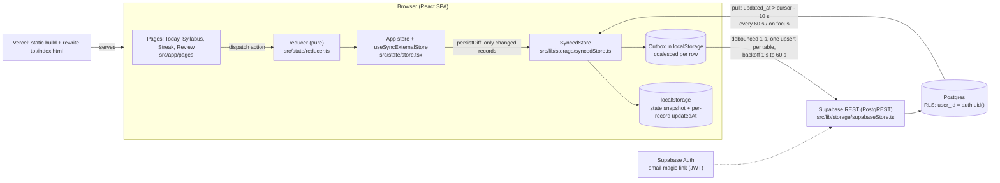
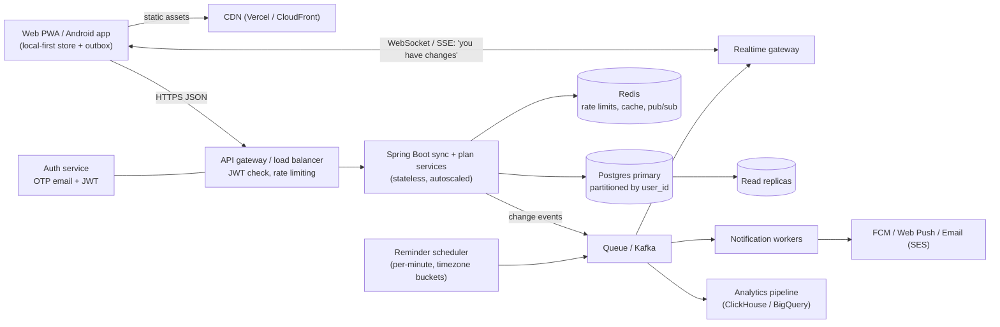

# Persist — Interview Prep Guide

> A prep guide for **me, the person who built Persist**, for SWE intern / new-grad interviews.
> Every answer is grounded in what this repo actually does (file paths included). Where the code is
> weak or missing something, the answer says so: interviewers respect honesty far more than bluffing.

**Quick facts I should know cold**

| Fact | Value | Where |
| --- | --- | --- |
| Stack | React 18 + TypeScript + Vite 5 + Tailwind 3, framer-motion, react-router-dom 6, date-fns, Supabase (Postgres + Auth), suncalc, uuid | `package.json` |
| Size | ~7,300 lines in `src/` across 49 files | `src/` |
| Tests | **52 Vitest tests** in 5 files (reducer 11, planModel 8, dayCycle 12, supabaseStore 7, sync 14) | `src/**/*.test.ts` |
| Reducer | 32 action cases, pure function | `src/state/reducer.ts` |
| Base plan | 13 weeks from Fri 2 Oct 2026, 5 subjects, 65 topics, 9 blocks/day, 5 Sunday tasks | `src/data/plan.ts` |
| Streak rule | Mon–Sat: ≥70% of the day's tasks **and** ≥1 DSA task; Sunday: 3 of 5 (60%, rescaled) | `src/lib/streak.ts` |
| Sync timings | 1 s debounce, backoff 1 s → 60 s, pull every 60 s, 10 s pull overlap, 1,000-row pages | `src/lib/storage/syncedStore.ts`, `supabaseStore.ts` |
| Bundle | one JS chunk: **682 kB min / 204 kB gzip** with Supabase configured (455 kB / 145 kB without) | `npm run build` |
| Hosting | Vercel static build + SPA rewrite | `vercel.json` |

---

## Contents

1. [Project in 60 seconds](#1-project-in-60-seconds)
2. [Questions by topic](#2-questions-by-topic)
   - [a. Ownership and decisions](#a-project-ownership-and-decisions) · [b. React](#b-react) · [c. TypeScript](#c-typescript) · [d. State and data modelling](#d-state-management-and-data-modelling) · [e. Core algorithms](#e-core-algorithms) · [f. Dates and time](#f-dates-and-time) · [g. Offline-first sync](#g-offline-first-sync-and-distributed-systems-basics) · [h. Database](#h-database-postgresql-via-supabase) · [i. Security](#i-security) · [j. Testing](#j-testing) · [k. Performance and quality](#k-performance-and-frontend-quality) · [l. Deployment](#l-deployment-and-devops) · [m. System design](#m-system-design-hard) · [n. Low-level design](#n-low-level-design-hard) · [o. Behavioural](#o-behavioural-star)
3. [Rapid-fire round](#3-rapid-fire-round)
4. [Coding round practice](#4-coding-round-practice-from-this-project)
5. [Weak spots and honest answers](#5-weak-spots-and-honest-answers)
6. [Glossary](#6-glossary)
7. [7-day revision checklist](#7-7-day-revision-checklist)

---

## 1. Project in 60 seconds

### The 60-second pitch (say it out loud)

> **Problem.** For placement season I set myself a 13-week plan: DSA, Java and Spring Boot, CS fundamentals, AI and aptitude, about ten hours a day. Spreadsheets didn't keep me honest. I'd miss a block, forget it, and lose track of what was due.
>
> **What I built.** Persist is a study tracker web app. It shows today's hour-by-hour timetable from the plan, lets me tick blocks off, and automatically carries unfinished work forward at midnight. It also computes a streak with clear rules: a weekday counts at 70% of tasks with at least one DSA block. Plus a syllabus view, a GitHub-style heatmap and a weekly review.
>
> **Stack.** React and TypeScript on Vite, Tailwind, deployed on Vercel. Data is offline-first: every change saves to localStorage immediately, then syncs to Supabase Postgres through an outbox with retries, protected by Row Level Security.
>
> **Hard problem.** Making sync safe across my laptop and phone. Two devices rolling over the same midnight must not create duplicate carried tasks, so carried items get deterministic ids, a uuid v5 of my user id plus the source date and task. The merge is "newer `updated_at` wins" per row, deletes are soft so they reach every device, and the whole engine sits behind a `RemoteBackend` interface so I can swap Supabase for my own Spring Boot API later.
>
> **Result.** It's live, I use it daily, and the core logic is covered by 52 unit tests, including simulated two-device sync with a fake server and mocked clocks.

### Resume bullet (2 lines)

> **Persist — offline-first study-streak tracker** (React, TypeScript, Supabase/Postgres, Vercel). Built a local-first sync engine (persistent outbox, exponential backoff, last-write-wins merge, deterministic UUIDv5 ids, soft deletes) behind a swappable storage interface, with per-user Row Level Security; 52 Vitest tests including simulated multi-device sync.

### "Tell me about a project" opener (1 line)

> "I built Persist, an offline-first study tracker I use every day for placements. The interesting part is a sync engine that keeps my laptop and phone consistent without ever losing a tick, even offline."

### Architecture



**How to walk through it:** UI → pure reducer → store → `persistDiff` finds what changed by reference equality → `SyncedStore` writes locally first and queues the change → the outbox flushes to Supabase → pulls merge server changes back by `updated_at`.

---

## 2. Questions by topic

## a. Project ownership and decisions

### Q1. Why did you build this project?  `[Easy]`
**Why interviewers ask this:** Motivation, and whether this is a real product or a tutorial clone.

**Strong answer:**
I'm preparing for placements with a fixed 13-week plan: five subjects, about ten hours a day. Generic to-do apps didn't know my plan, and a spreadsheet didn't stop me silently skipping DSA. So I encoded the plan itself in `src/data/plan.ts` (weeks, topics, a 9-block timetable, Sunday checkpoint tasks) and built rules on top. A day only counts for my streak if I finish 70% of it **and** at least one DSA block. Unfinished blocks carry forward automatically instead of disappearing. I use it every day, so I'm also the user who finds the bugs.

**Likely follow-ups:**
- *Who else could use it?* → Any student with a structured plan. Today it's single-user by design (see Weak spots), but the plan is data, so it could be generalised.
- *How do you know it works?* → I use it daily, and the rules are unit-tested (`src/state/reducer.test.ts`, `src/lib/planModel.test.ts`).

**Red flags to avoid:** "I just wanted to learn React." "It's like a to-do app." Not being able to say what makes it different (plan-aware rules, carry-forward, offline-first sync).

---

### Q2. Why this stack: React + TypeScript + Vite + Tailwind + Supabase?  `[Easy]`
**Why interviewers ask this:** Whether choices were deliberate or copied.

**Strong answer:**
- **React + TypeScript:** the UI is very stateful (checkboxes, inline edit forms, modals), and TS catches shape errors in a fairly complex state (`src/state/types.ts`).
- **Vite:** fast dev server and a simple static build that Vercel serves directly.
- **Tailwind:** I could keep one visual language across the landing page and the four tracker pages without writing CSS files.
- **Supabase:** it gave me Postgres, auth (email magic link) and Row Level Security without writing a backend yet. That let me ship sync in days instead of weeks.
- **date-fns:** small, pure date functions (`differenceInCalendarDays`, `format`).
- **suncalc:** real sunrise and sunset times for the landing hero.

**Likely follow-ups:**
- *Why not Next.js?* → No SEO or server rendering needs; it's a personal app behind no login wall. A static SPA on Vercel is simpler.
- *Why not Redux?* → One reducer and a tiny external store were enough (`src/state/store.tsx`). Redux would add ceremony without a benefit here.

**Red flags to avoid:** "Everyone uses it." Listing tools without one concrete reason each.

---

### Q3. Did you use AI tools? How much of this did you write?  `[Medium]`
**Why interviewers ask this:** Honesty, and whether you actually understand the code you're presenting.

**Strong answer:**
Yes. I built Persist with Claude Code as a pair programmer, and I'm open about that. My job was the product and engineering decisions:
- the rules: 70% plus DSA, max 3 skips, one freeze a week;
- offline-first with an outbox;
- Supabase now behind an interface so I can move to Spring Boot;
- reviewing every change before it went in.

I kept quality with gates: `npm test` (52 tests), `npm run lint`, `npm run build` (type-check) before every commit. For the day–night feature I explicitly asked for changes to stay uncommitted until I reviewed them. I also checked that the tests catch real bugs: we deliberately broke the merge rule in `src/lib/storage/merge.ts`, and the offline-edit test failed as it should. I can walk you through any file, for example how `persistDiff` in `src/lib/storage/diff.ts` finds changes by reference equality.

**Likely follow-ups:**
- *What did the AI get wrong?* → An early test for "no duplicate carried items across devices" didn't really test anything: a fresh device had already rolled past Monday. I caught it and rewrote it with seeded state. Another one: the spec said uuid v5 of `sourceDate + blockId`, but the table's primary key is global, so two users would collide. The id now includes the user id (`carriedUuid` in `src/lib/storage/supabaseStore.ts`).
- *Could you rebuild the streak logic without AI?* → Yes. It's about 40 lines in `src/lib/streak.ts`, and I can write it on the whiteboard (see Q37).

**Red flags to avoid:** Denying it, or the opposite: "the AI did it, I don't know." Not being able to explain a file you put on your resume.

---

### Q4. Why Supabase now instead of your own Spring Boot backend?  `[Medium]`
**Why interviewers ask this:** Pragmatism vs over-engineering, and whether you designed for change.

**Strong answer:**
Shipping sync mattered more than owning the server on day one. Supabase gives Postgres, auth and per-row security policies, so my "backend" is a SQL migration (`supabase/migrations/001_init.sql`, `002_plan_extension.sql`). I still kept the door open. The app never imports supabase-js directly. Only `src/lib/storage/supabaseStore.ts` and `src/lib/supabase.ts` do. Everything else talks to the `RemoteBackend` interface in `src/lib/storage/types.ts`, which has six methods: `getUser`, `onAuthChange`, `signIn`, `signOut`, `upsert(table, records)` and `pull(table, since)`. A Spring Boot client would implement those, and I'd change one line in `src/lib/storage/index.ts`.

**Likely follow-ups:**
- *What would the Spring Boot API look like?* → `POST /sync/{table}` for batched upserts returning server timestamps, `GET /sync/{table}?since=` for pulls, JWT auth, and the ownership check in the service layer instead of RLS.
- *What do you lose with Supabase?* → Less control over business-rule validation on the server: RLS checks ownership, not that a day's JSON is valid. That's vendor coupling for auth, but it's isolated to one file.

**Red flags to avoid:** "Supabase is easier." Not mentioning the abstraction, or claiming the Spring Boot backend already exists (it doesn't).

---

### Q5. What trade-offs did you consciously make?  `[Medium]`
**Why interviewers ask this:** Engineering judgement.

**Strong answer:**
1. **Offline-first over server-first.** Writes never wait for the network (`LocalStore` writes immediately). The cost is conflict handling.
2. **Last-write-wins per row over CRDTs.** Simple and testable (`mergePulled` in `src/lib/storage/merge.ts`). The cost: two devices editing the same day offline means one version wins for the whole day.
3. **A day as one JSONB document** (`days.data`) instead of a normalised table per block. Easy sync of one record per date. The cost: harder server-side queries and validation.
4. **Soft deletes** (`dropped`, `deleted` columns) so deletions sync; the cost is rows that never go away.
5. **The base plan in code, user data as overrides** (`overrides`, `plan.weeks`). Editing a day never mutates the plan. The cost is merge logic in `src/lib/planModel.ts`.

**Likely follow-ups:**
- *Which trade-off would you revisit first?* → Row-level last-write-wins for `days`. I'd move to per-field merges or server versions (see Q53).
- *Why not normalise blocks?* → A day is always read and written as a unit, and sync is per row. JSONB keeps it to one upsert per day.

**Red flags to avoid:** "There were no trade-offs." Listing trade-offs without the cost side.

---

### Q6. What would you change if you started again?  `[Medium]`
**Why interviewers ask this:** Self-awareness and growth.

**Strong answer:**
- **Code-split from the start:** lazy-load the `/app` routes and supabase-js. The bundle is one 682 kB chunk today.
- **Server-assigned versions** instead of comparing client and server timestamps in the merge.
- **Namespace local storage by user id**, so two accounts on one browser can't mix.
- **Drop the 1–13 range on `reviews.week`.** I added it when the plan was fixed at 13 weeks, then made the plan open-ended. That check now blocks review sync after week 13 (see Weak spots #1).
- **Add CI and a couple of Playwright end-to-end tests** for the Today page.

**Likely follow-ups:**
- *Why didn't you do it already?* → Ordering: features I used daily came first. These are next on my list, and I can explain each fix.

**Red flags to avoid:** "Nothing." Or an endless list with no priorities.

---

### Q7. What was the hardest part?  `[Medium]`
**Why interviewers ask this:** Depth, and whether you can explain a hard thing simply.

**Strong answer:**
Carry-forward that's idempotent across devices. Rollover runs on load, every 60 seconds and when the tab becomes visible (`src/state/store.tsx`), on every device. It must never duplicate a task, never resurrect one I dropped, and never change a past day's streak verdict. The design:
- Carried ids are deterministic: `"<sourceDate>:<taskId>"` (`carryId` in `src/lib/tasks.ts`).
- A `rolledThrough` cursor records which past days were already scanned.
- Dropped ids stay as tombstones in `carryDropped`.
- Completion is stored on the carried item (`completedOn`), not on the original day.

On the server the same id becomes a uuid v5, so two devices upsert the same row. A test simulates exactly that and asserts 7 rows, not 14 (`src/lib/storage/sync.test.ts`).

**Likely follow-ups:**
- *What if the app wasn't opened for 3 days?* → One rollover: items from all three days go straight to today, with one move each, not three (Q34).
- *Why not just mark the original block done?* → That would change a past day's verdict and rewrite history.

**Red flags to avoid:** "CSS was hard." Picking something you can't explain technically.

---

## b. React

### Q8. Props vs state, and where state lives in this app.  `[Easy]`
**Why interviewers ask this:** React fundamentals.

**Strong answer:**
Props are inputs from a parent; state is data a component owns and can change. In Persist:
- **App data** (days, carried items, plan) lives in one store (`src/state/store.tsx`), read with `useStore()`.
- **UI-only state stays local.** For example, `TaskRow` in `src/app/pages/Today.tsx` keeps whether its edit form is open, and `TaskForm` keeps its draft values in `useState` until Save.
- **Props flow down.** For example, `RoundCheck` in `src/components/ui.tsx` gets `checked` and `onChange` and owns nothing.

Keeping drafts local means half-typed edits never hit storage or sync.

**Likely follow-ups:**
- *When would you lift state up?* → When two siblings need it. The Syllabus page keeps `editing` (which week is open) in the parent so only one week editor is open at a time.
- *Derived state?* → I don't store it. A day's percentage is computed from the day by `dayStats`, never saved.

**Red flags to avoid:** "State is for everything." Copying props into state and letting them drift.

---

### Q9. Which hooks did you use, and where?  `[Easy]`
**Why interviewers ask this:** Practical hook knowledge.

**Strong answer:**
- **`useState`:** forms, modals, toggles (everywhere).
- **`useEffect`:**
  - the rollover interval and visibility listener in `src/state/store.tsx`;
  - the clock tick in `useNow` (`src/lib/hooks.ts`);
  - the sky clock in `src/landing/sky/useSkyState.ts`;
  - auto-scrolling the heatmap in `src/app/pages/Streak.tsx`.
- **`useContext`:** `useStore()`, `useToast()`.
- **`useMemo`:** the day's task list in `Today.tsx`, and phases and weeks in `Syllabus.tsx`.
- **`useRef`:**
  - the heatmap scroll container (`Streak.tsx`);
  - the scroll target for the letter-by-letter reveal (`src/landing/About.tsx`);
  - the toast timer (`ui.tsx`);
  - the hidden file input (`SettingsModal.tsx`).
- **`useCallback`:** the toast `show` function.
- **`useSyncExternalStore`:** the app store and the sync status.

To be precise, I don't use `useReducer`. I use a pure reducer function with my own small store (Q24 explains why).

**Likely follow-ups:**
- *Why `useRef` for the toast timer, not state?* → Changing it shouldn't re-render. I only need to clear the previous timeout.
- *Where's a custom hook?* → `useNow`, `useSkyState`, `useSync`, `useStore`, `usePrefersReducedMotion`.

**Red flags to avoid:** Claiming `useReducer` (the code doesn't use it). Using `useMemo` everywhere "for performance".

---

### Q10. What causes a re-render here, and how did you avoid unnecessary ones?  `[Medium]`
**Why interviewers ask this:** Rendering model understanding.

**Strong answer:**
A component re-renders when its state changes, its parent re-renders, or a context or external store it reads changes. In Persist:
- Every dispatch replaces the store state, and `useSyncExternalStore` re-renders every component using `useStore()`.
- `useNow()` re-renders the Today page every 30 seconds so the **Now** highlight and day rollover stay current.

Mitigations:
- The reducer only replaces the objects it touched. That keeps diffing cheap and lets `useMemo(() => getDayTasks(...), [day, key, state.plan])` skip recomputing when an unrelated day changes.
- Per-letter animation components in `About.tsx` read a framer-motion `MotionValue`, so scrolling doesn't re-render React at all.

**Likely follow-ups:**
- *What's not optimised?* → The context value in `StoreProvider` is a new object on every render, and every consumer re-renders on any change. Fine at this size; at scale I'd use selector-based subscriptions.
- *How would you measure?* → React DevTools Profiler, "highlight updates".

**Red flags to avoid:** "React re-renders only what changed in the DOM, so it doesn't matter." Mixing up re-render and DOM update.

---

### Q11. Context performance pitfalls: do you have any?  `[Medium]`
**Why interviewers ask this:** Real-world React scaling knowledge.

**Strong answer:**
Yes, one. `StoreProvider` passes `value={{ state, dispatch, exportAll: () => ... }}`, a new object every render (`src/state/store.tsx`), so every `useStore()` consumer re-renders whenever anything changes. I accepted that because there are only four pages and the data is small. To fix it:
1. Split the store into a state context and a stable dispatch context.
2. Or better, expose `useStoreSelector(selector)` built on `useSyncExternalStore`, so a component re-renders only when its slice changes.

The toast context is already stable: `show` is wrapped in `useCallback`.

**Likely follow-ups:**
- *Why does `useSyncExternalStore` help?* → It subscribes outside React and compares snapshots, so selectors can bail out.
- *Would `useMemo` on the value fix it?* → It stops re-renders caused by the parent, but not those caused by state changes, since state is a dependency.

**Red flags to avoid:** "Context is slow, never use it." Not knowing the value-identity problem.

---

### Q12. Explain effect cleanup with an example from your code.  `[Medium]`
**Why interviewers ask this:** Leaks and stale listeners are common bugs.

**Strong answer:**
The cleanup function runs before the effect re-runs and on unmount. In `StoreProvider`:
- **The effect sets up:**
  - a 60-second rollover interval;
  - a `visibilitychange` listener;
  - subscriptions to remote changes and notices;
  - `storage.start()`.
- **The cleanup undoes it:** it clears the interval, removes the listener, unsubscribes and calls `storage.stop()`. It also sets a `cancelled` flag, because `whenReady()` is a promise that may resolve after unmount.

`useNow` (`src/lib/hooks.ts`) clears its interval the same way. In development, React StrictMode mounts, unmounts and remounts once, so `start()` and `stop()` in `SyncedStore` are written to be safe to call twice.

**Likely follow-ups:**
- *What happens without cleanup?* → Duplicate intervals after remounts, so rollover would be dispatched twice a minute, and a leak.
- *Why the `cancelled` flag?* → To avoid starting an interval after the component is gone. That's the "set state on unmounted component" class of bug.

**Red flags to avoid:** "Cleanup is only for unmount." Forgetting async work that resolves later.

---

### Q13. How do you use keys in lists?  `[Easy]`
**Why interviewers ask this:** Reconciliation basics.

**Strong answer:**
Keys tell React which item is which between renders. I use stable ids wherever items can be added, removed or reordered:
- carried rows use `item.id` (like `2026-10-05:dsa2`);
- task rows use the block or custom-task id;
- heatmap columns use the week number.

When I edit a block's time, the timetable re-sorts (`DayList` in `Today.tsx`), and stable keys keep each row's open edit form and checkbox state attached to the right task. I only use index keys on static lists that never reorder: the words in `WordsPullUp` and the 120 fixed stars in `SkyLayers.tsx`.

**Likely follow-ups:**
- *What breaks with index keys on a sortable list?* → State sticks to positions. An open edit form would jump to a different task after re-sorting.

**Red flags to avoid:** "Keys are for performance only." Using `Math.random()` as a key.

---

### Q14. Controlled vs uncontrolled inputs here?  `[Easy]`
**Why interviewers ask this:** Forms are everywhere.

**Strong answer:**
Almost all inputs are **controlled**. Their value comes from state, and `onChange` updates it. For example, `TaskForm` in `Today.tsx` holds the text, start, end and subject, validates on submit (end must be after start), then dispatches once. The morning and night textareas are controlled by the store directly (`setText` action). The one **uncontrolled** input is the hidden `<input type="file">` in `SettingsModal.tsx`: I read the file via a ref and reset `e.target.value` so the same file can be imported twice.

**Likely follow-ups:**
- *Downside of storing textarea text in the global store?* → Each keystroke is an action. That writes the whole snapshot to localStorage and queues an outbox entry. Upload is debounced to 1 s, but local writes aren't. Weak spot #8.

**Red flags to avoid:** Not knowing that an input with `value` and no `onChange` is read-only.

---

### Q15. How does routing work, and why does Vercel need a rewrite?  `[Medium]`
**Why interviewers ask this:** SPA fundamentals.

**Strong answer:**
I use `BrowserRouter` (`src/main.tsx`) with nested routes in `src/App.tsx`:
- `/` is the landing page;
- `/app` renders `AppShell`, with an `<Outlet />` for `Today` (index), `syllabus`, `streak` and `review`;
- `*` redirects to `/`.

`NavLink` marks the active tab. Routing happens in the browser, but if you refresh `/app/streak`, the browser asks the server for that path, and a static host has no such file, so it would 404. `vercel.json` rewrites every path to `/index.html`, and React Router takes over from there. Netlify gets the same via `public/_redirects`.

**Likely follow-ups:**
- *Why not `HashRouter`?* → It avoids the rewrite but gives ugly `#/` URLs, and the magic-link redirect to `/app` is cleaner without a hash.
- *Do static assets still load?* → Yes. Vercel serves real files first and only rewrites paths that don't match a file.

**Red flags to avoid:** "React Router talks to the server." Not knowing why deep links 404.

---

### Q16. How do you handle reduced motion and animations?  `[Medium]`
**Why interviewers ask this:** Accessibility and attention to detail.

**Strong answer:**
- `App.tsx` wraps everything in `<MotionConfig reducedMotion="user">`, so framer-motion turns transform animations into simple fades when the OS asks for reduced motion.
- `src/index.css` shortens CSS transitions and turns off the star twinkle under `prefers-reduced-motion`.
- The landing sky uses `usePrefersReducedMotion()` (`src/lib/hooks.ts`) to switch its 60-second colour transitions to instant, while still showing the correct time of day (`src/landing/Hero.tsx`).

**Likely follow-ups:**
- *Why still animate opacity?* → Fades are generally fine for vestibular sensitivity; large movement is the problem.

**Red flags to avoid:** Not knowing the media query exists.

---

## c. TypeScript

### Q17. type vs interface: how did you choose?  `[Easy]`
**Why interviewers ask this:** TS basics.

**Strong answer:**
I use `interface` for object shapes that describe records, like `DayRecord`, `CarriedItem` and `UserWeek` in `src/state/types.ts`, and `TrackerStorage` and `RemoteBackend` in `src/lib/storage/types.ts`. I use `type` for unions and aliases: `TaskSubject = SubjectId | null`, `Action` (the 32-case union), `SyncRecord`, `TableName`. Interfaces can be extended and merged; type aliases can express unions, which interfaces can't.

**Likely follow-ups:**
- *Can a class implement a type alias?* → Yes, if it's an object type. `LocalStore implements TrackerStorage`, which is an interface, in `localStore.ts`.

**Red flags to avoid:** "They're identical." Or "always use one" with no reason.

---

### Q18. How did you type the reducer and its actions?  `[Medium]`
**Why interviewers ask this:** Discriminated unions are the core TS skill for state code.

**Strong answer:**
`Action` in `src/state/types.ts` is a discriminated union on `type`: `{ type: 'toggleBlock'; date; id } | { type: 'skipTask'; date; id; reason } | ...`. In `reducer(state, action)` (`src/state/reducer.ts`), `switch (action.type)` narrows `action` in each case, so `action.reason` only exists inside `'skipTask'`. The return type is `TrackerState`, and with `strict` on, a missing case that falls through gives an error. I used the same pattern for `SyncRecord` (discriminated on `table`). When I added the `plan_weeks` and `plan_phases` tables, TypeScript flagged every switch that didn't handle them, in `toRow`, `rowKey` and `fromRow` (`src/lib/storage/supabaseStore.ts`), before I even ran the app.

**Likely follow-ups:**
- *How do you force exhaustiveness explicitly?* → A `default:` branch with `const _never: never = action`.

**Red flags to avoid:** Typing actions as `{ type: string; payload: any }`.

---

### Q19. Give an example of type narrowing and type guards in your code.  `[Medium]`
**Why interviewers ask this:** Working with unknown data safely.

**Strong answer:**
Anything from localStorage, a JSON import or the server is typed `unknown` and validated:
- `isObj(v): v is Record<string, unknown>` in `src/state/reducer.ts` is a user-defined type guard.
- `sanitizeDay`, `sanitizeCarried`, `sanitizeUserWeek` and `sanitizePlan` build fully typed objects field by field, with defaults.
- In `src/data/plan.ts`: `TIMETABLE.filter((r): r is TimeBlock => r.kind === 'block')` narrows a mixed list of blocks and breaks.
- In `Today.tsx` I filter to topics whose title isn't null with a type predicate, so later code can use `t.title` as a string.

**Likely follow-ups:**
- *Why not just cast with `as`?* → A cast trusts the data. A corrupted import would crash later. Validation fails safe and fills defaults.

**Red flags to avoid:** `as any` everywhere; trusting `JSON.parse` output.

---

### Q20. Where did you use generics?  `[Medium]`
**Why interviewers ask this:** Reusable typed code.

**Strong answer:**
- `readJSON<T>(kv, key): T | null` in `src/lib/storage/kv.ts` gives a typed read with try/catch.
- `without<T>(rec: Record<string, T>, key)` in `src/state/reducer.ts` removes a key immutably and keeps the value type.
- `Record<SubjectId, Subject>` and `Record<TableName, string>` maps get compile-time completeness: adding a table forced me to add its conflict target in `CONFLICT` (`supabaseStore.ts`).
- The `Meta` type in `localStore.ts` is `Record<TableName, Record<string, string>>`.

**Likely follow-ups:**
- *What's a generic constraint?* → `<T extends { id: string }>`, for example to dedupe any items by id.

**Red flags to avoid:** Thinking generics are only for libraries.

---

### Q21. What does `satisfies` do, and where did you use it?  `[Medium]`
**Why interviewers ask this:** Modern TS fluency.

**Strong answer:**
`satisfies` checks that a value matches a type without widening its inferred type. In `src/lib/dayCycle.ts`, `LOOKS = { night: {...}, dawn: {...} } satisfies Record<string, Look>`. Every look must have every field, but `LOOKS.night` keeps its exact keys, so `LOOKS.golden` autocompletes. In `syncedStore.ts` I write `{ userId: null, lastPulledAt: {} } satisfies SyncMeta` before saving.

**Likely follow-ups:**
- *Difference from `: Record<string, Look>`?* → An annotation widens the type, so `LOOKS.typo` would be allowed and specific keys would be lost.

**Red flags to avoid:** Confusing `satisfies` with `as`.

---

### Q22. How did TypeScript actually help in this project?  `[Easy]`
**Why interviewers ask this:** Whether you value types for real reasons.

**Strong answer:**
Three concrete ways:
1. **Refactors were safe.** When I made the plan open-ended, removing `TOTAL_WEEKS`, `ALL_TOPICS`, `PHASES` and `phaseForWeek` made `tsc` list every file still using them: AppShell, Syllabus, Review, Streak, Today, Hero. I fixed them one by one.
2. **Discriminated unions** keep actions and sync records honest.
3. **The `RemoteBackend` interface** is a typed contract a future Spring Boot client must meet.

`tsconfig.app.json` has `strict`, `noUnusedLocals` and `noUnusedParameters`, and `npm run build` runs `tsc -b` first, so a type error fails the build.

**Red flags to avoid:** "TS just adds autocomplete."

---

## d. State management and data modelling

### Q23. Describe the shape of your state.  `[Medium]`
**Why interviewers ask this:** Data modelling is a core skill.

**Strong answer:**
`TrackerState` in `src/state/types.ts`:

```ts
{
  days: Record<'yyyy-mm-dd', DayRecord>,   // one record per calendar day
  topicsDone: Record<topicId, 'yyyy-mm-dd'>, // e.g. 'w3-dsa' -> date ticked
  carried: CarriedItem[],                    // carry-forward items
  carryDropped: string[],                    // tombstones of dropped carry ids
  rolledThrough: 'yyyy-mm-dd',               // rollover cursor
  reviews: Record<week, ReviewRecord>,
  plan: { weeks: Record<week, UserWeek>, phases: Record<id, UserPhase> },
  settings: { version: 2 }
}
```

A `DayRecord` holds:
- `blocks` / `sundayTasks` (id → done);
- counters `dsa`, `apps`, `hours`;
- `topicsCovered`, and `morning` / `night` notes;
- `frozen`;
- `overrides` (per-date edits), `skipped` (id → reason), `customTasks[]` and `movedOut[]`.

**Likely follow-ups:**
- *Why keyed by date string?* → O(1) lookup for "today", it's a natural primary key, and it maps 1:1 to the `days` table `(user_id, date)`.
- *Why is `carried` an array, not a map?* → Display order matters on the Today page. Lookups use `find` over a small list.

**Red flags to avoid:** Not knowing your own state shape.

---

### Q24. Why a pure reducer + external store instead of `useReducer`?  `[Hard]`
**Why interviewers ask this:** Tests understanding of where side effects belong.

**Strong answer:**
I wanted every change persisted **exactly once and synchronously**, with access to both the previous and next state so I can save only what changed. With `useReducer`, the reducer must stay pure, and the next state is only visible after render. Persisting in an effect means running after paint, and in StrictMode effects can run twice. So `createAppStore()` in `src/state/store.tsx` does `next = reducer(state, action)`, then `persistDiff(prev, next, storage)`, then notifies subscribers. React reads it with `useSyncExternalStore`, which is concurrent-safe. The reducer in `src/state/reducer.ts` stays 100% pure, which is why it's trivially unit-testable.

**Likely follow-ups:**
- *What's `persistDiff`?* → `src/lib/storage/diff.ts`. Because the reducer only replaces objects it changed, `prev.days[date] !== next.days[date]` identifies changed days without a deep compare. It then calls `saveDay`, `saveCarried`, etc.
- *What about remote changes?* → They come in as a `replace` action, which skips `persistDiff` because the storage layer already holds them.

**Red flags to avoid:** "useReducer is old." Putting side effects inside the reducer.

---

### Q25. How are per-day edits, skips and moves modelled, and why not change the plan?  `[Medium]`
**Why interviewers ask this:** Separating source data from user deltas.

**Strong answer:**
The plan lives in code (`src/data/plan.ts`) plus user weeks (`state.plan`). A day stores only the **differences**:
- `overrides[taskId] = { text, start?, end?, subject }`;
- `skipped[taskId] = reason`;
- `movedOut[]`;
- `customTasks[]`.

`getDayTasks(day, date, plan)` in `src/lib/tasks.ts` merges them into the effective list, and it keeps the base values (`task.base`), so the night check-in can print "old → new". "Reset to plan" just deletes the override. "Apply to rest of this week" writes the same override into each remaining date. The plan itself is never mutated.

**Likely follow-ups:**
- *Why does a moved-out block still count against today?* → Otherwise "move to tomorrow" would be an unlimited skip. Only `skipped` leaves the denominator, and the reducer caps it at 3 a day.

**Red flags to avoid:** Copying the whole plan into every day.

---

### Q26. Is your data normalised?  `[Medium]`
**Why interviewers ask this:** Normalisation trade-offs.

**Strong answer:**
Partly, on purpose:
- **Entities are keyed by id or date:** `days`, `topicsDone`, `reviews`, `plan.weeks`, `plan.phases`. There's no nested duplication, and topic ids are stable (`w{n}-{subject}`), so editing a week's topic text doesn't lose the tick.
- **Inside a day, data is denormalised into one JSON document**, because it's always read and written together and syncs as one row.
- **Carried items copy their text** at carry time (`carryText` in `tasks.ts`). That's deliberate: the history should show what the task was, even if I later edit the plan.

**Likely follow-ups:**
- *Downside of copying text?* → Fixing a typo in the plan doesn't update already-carried items. Acceptable for a history record.

**Red flags to avoid:** "Everything is normalised", or not knowing the term.

---

### Q27. How do you migrate saved data when the shape changes?  `[Medium]`
**Why interviewers ask this:** Real apps evolve.

**Strong answer:**
Storage keys are versioned (`prisma-tracker-v1` → `v2`) and every load goes through `sanitize(raw, today)` in `src/state/reducer.ts`. If the data has no `carried` field, it's v1: I convert old unchecked past blocks into carried items, keep v1 "done later" items as completed carried items, and keep v1 drops as tombstones. A test covers it (`'migrates v1 data into carried items'`). The v1 key is left in place as a backup. When I renamed the app from Prisma to Persist, I deliberately kept the `prisma-` keys (with a comment in `localStore.ts`), because renaming them would have orphaned all saved progress.

**Likely follow-ups:**
- *Server-side migrations?* → Numbered SQL files, `001_init.sql` and `002_plan_extension.sql`, written to be safe to re-run (`if not exists`, `drop policy if exists`).

**Red flags to avoid:** "I'd just clear the data."

---

### Q28. Why is the plan "base + user weeks", and how is a week resolved?  `[Medium]`
**Why interviewers ask this:** Extensibility design.

**Strong answer:**
The original 13 weeks are code. Users add weeks 14+ or override any base week, and those live in `state.plan.weeks` keyed by week number. `getWeek(plan, n)` in `src/lib/planModel.ts`:
- uses the user week if one exists, else the base week, else an empty week with null topics (placeholders like "Set this week's DSA topic");
- computes the dates (`weekStart(n) = 2 Oct + 7·(n−1)`);
- picks the phase: the week's explicit `phaseId`, else the latest-starting user phase covering `n`, else the base phase, else "Phase 4 — Keep going".

**Likely follow-ups:**
- *Why keep topic ids the same when overriding?* → Ticks are keyed by `w{n}-{subject}`, so editing a base week keeps them.

**Red flags to avoid:** Hard-coding "13" everywhere. The app used to, and I removed it (`BASE_WEEKS` is the only constant now).

## e. Core algorithms

### Q29. How do you compute the week number from a date?  `[Easy]`
**Why interviewers ask this:** Off-by-one and date arithmetic.

**Strong answer:**
Week 1 starts Friday 2 Oct 2026 (`PLAN_START` in `src/data/plan.ts`), and plan weeks run Friday–Thursday. `weekNumberFor(d)` in `src/lib/dates.ts`:

```ts
const diff = differenceInCalendarDays(d, PLAN_START); // calendar days, DST-safe
if (diff < 0) return 1;                                // before the start: show week 1
return Math.floor(diff / 7) + 1;                       // no upper limit
```

It's O(1). Tests check 2 Oct = 1, 31 Dec 2026 = 13, 1 Jan 2027 = 14 and 15 Mar 2027 = 24 (`src/lib/planModel.test.ts`). The inverse is `weekStart(n) = PLAN_START + 7·(n−1)` days.

**Likely follow-ups:**
- *Why `differenceInCalendarDays` and not milliseconds / 86,400,000?* → With DST a day can be 23 or 25 hours; dividing milliseconds can be off by one. Calendar-day difference counts date boundaries.
- *Why clamp before the start to 1?* → So the Today page can show week 1 as a warm-up the day before the plan starts.

**Red flags to avoid:** `Math.round` instead of `floor`; ignoring dates before the start.

---

### Q30. How is a single day's verdict ("counts for streak") decided?  `[Medium]`
**Why interviewers ask this:** Translating business rules into code.

**Strong answer:**
`dayStats(day, date)` in `src/lib/streak.ts`:
1. Gets the day's **effective** tasks from `getDayTasks` (`src/lib/tasks.ts`): planned blocks minus skipped ones, plus custom tasks. Carried items are **not** included.
2. **Mon–Sat:** `need = ceil(0.7 × total)`, and the day counts if `done ≥ need` **and** at least one done task has subject `dsa`.
3. **Sunday:** `need = ceil(total × 3/5)`: 3 of 5 normally, rescaled if tasks were skipped or added.
4. It returns `{done, total, pct, dsaDone, counts, needed}`. `needed = max(need − done, dsaDone ? 0 : 1)` drives the "Not yet — k more blocks" text.

I subtract a tiny epsilon before `ceil` so floating-point error (like 0.7 × 10 = 7.000000001) can't round up wrongly.

**Likely follow-ups:**
- *Why can't carried items count?* → Then clearing old work would retroactively change days, and carry-overs would make today harder. They're tracked separately with `completedOn`.
- *What if every task is skipped?* → `total = 0`, so it doesn't count. The reducer caps skips at 3 a day, so a weekday always has at least 6 of 9 blocks.

**Red flags to avoid:** Hard-coding `done >= 7`. That breaks once skips and custom tasks exist.

---

### Q31. Current streak: how does it work, including "today doesn't break it" and freezes?  `[Medium]`
**Why interviewers ask this:** Classic interview logic with edge cases.

**Strong answer:**
`currentStreak(state, today)` in `src/lib/streak.ts`:
- Start at **today if today already counts, otherwise yesterday**. So an unfinished today never shows a broken streak while the day is still running.
- Walk backwards one day at a time:
  - a counting day adds 1;
  - a frozen day keeps the chain alive but adds 0;
  - anything else stops the walk.
- The walk stops at a floor of `PLAN_START − 60` days, so it always ends.

Time is O(L × T): L is the streak length including frozen days, T the tasks per day (about 9–15). Space is O(1).

**Likely follow-ups:**
- *Test?* → 31 Dec, 1 Jan and 2 Jan counted, today 3 Jan not yet: streak 3 (`src/lib/planModel.test.ts`).
- *Why a floor?* → It makes termination explicit even with odd data, and still allows a bit of practice before the plan starts.

**Red flags to avoid:** Starting from today unconditionally (shows 0 every morning); treating frozen days as +1.

---

### Q32. Longest streak and its complexity.  `[Medium]`
**Why interviewers ask this:** Single-pass algorithms.

**Strong answer:**
`longestStreak` iterates every plan day from 2 Oct through today (`planDaysThrough(today)` in `src/lib/dates.ts`) keeping `run` and `best`:
- counting day → `run++`, `best = max(best, run)`;
- frozen day → `continue` (doesn't break, doesn't add);
- a past non-counting day → `run = 0`. Today never resets the run.

Finally it returns `max(best, currentStreak)`, which covers practice days before the plan started. Time is O(D × T) for D days elapsed; space O(D) for the date array, which could be O(1) with a running date.

**Likely follow-ups:**
- *Could you cache it?* → Yes, recompute only from the last changed day. With D ≈ 100–400 it isn't worth the complexity yet.
- *SQL version?* → The gaps-and-islands query in section h (Q61).

**Red flags to avoid:** O(D²) nested loops; forgetting that today shouldn't reset the run.

---

### Q33. How do freezes work?  `[Easy]`
**Why interviewers ask this:** Encoding a policy as constraints.

**Strong answer:**
One freeze per **plan week** (Fri–Thu). `freezeUsedInWeek(state, week)` checks if any of that week's 7 days has `frozen: true`. `canFreezeYesterday` in `src/lib/streak.ts` allows a freeze only if:
- yesterday is on or after the plan start;
- it isn't already frozen;
- it didn't already count;
- the week's freeze is unused.

It returns a human-readable reason for the Streak page. A frozen day is skipped by both streak walks.

**Likely follow-ups:**
- *Why only yesterday?* → To stop people back-filling old gaps. The rule is "save yesterday, then move on."

**Red flags to avoid:** Letting a freeze also add to the streak.

---

### Q34. Explain the carry-forward rollover. Why is it idempotent?  `[Hard]`
**Why interviewers ask this:** Idempotency is a key distributed-systems idea.

**Strong answer:**
`rollover(state, today)` in `src/state/reducer.ts` runs on load, every 60 s and on tab focus. Two steps:
1. **Move open items.** Every carried item that isn't done and has `currentDate < today` moves to today with `moves + 1`. If I didn't open the app for 3 days, it moves **once**, straight to today, with no copies on the skipped days.
2. **Scan new days.** If `rolledThrough < yesterday`, it scans the days between (`datesToRoll` in `src/lib/tasks.ts`). For each unfinished, non-skipped task that's allowed to carry (Plan and Recall aren't), it creates `{ id: "<date>:<taskId>", currentDate: today, moves: 1 }`, unless that id already exists in `carried` or in the `carryDropped` tombstones. Then it sets `rolledThrough = yesterday`.

It's idempotent because ids are deterministic, existing and dropped ids are skipped, and if nothing changed it returns **the same state object**. A test asserts `rollover(s, TUE) === s` on the second run.

**Likely follow-ups:**
- *Complexity?* → O(C + Δ × T): C carried items, Δ days since `rolledThrough`, T tasks per day.
- *What about two devices?* → Same local id → same server uuid v5 → upserts collapse into one row (Q49).

**Red flags to avoid:** "I check if it already ran today" with a boolean flag. That isn't safe across devices or after a crash.

---

### Q35. What happens with a carried item over time: moves, drop, move to a date?  `[Medium]`
**Why interviewers ask this:** State machines.

**Strong answer:**
A carried item (`CarriedItem` in `src/state/types.ts`) has `sourceDate`, `currentDate`, `moves`, `done` and `completedOn`. Its life:
- **Created** by rollover (`moves = 1`), or by Delete → "Move to tomorrow" (`moveOut` action, with `currentDate` = tomorrow).
- **Moved** each rollover while not done (`moves + 1`). The UI shows "moved n×" from 2 moves on, and at 3+ moves an amber border with **Drop** and **Move to…** (`CarriedRow` in `Today.tsx`).
- **Done:** `toggleCarried` sets `completedOn`. The original day's verdict never changes.
- **Dropped:** removed from the list and added to the `carryDropped` tombstones. Undo (`restoreCarried`) puts it back at the same index within 5 seconds.
- **Move to…** sets `currentDate` to a future date. Rollover ignores it until that date.

**Likely follow-ups:**
- *Why tombstones?* → Without them, the next rollover would see the unfinished block on the source day and re-create the item.

**Red flags to avoid:** Hard-deleting dropped items.

---

### Q36. What edge cases did you handle in these algorithms?  `[Medium]`
**Why interviewers ask this:** Thoroughness.

**Strong answer:**
- **Dates before the plan start:** week 1, no heatmap, and freezes are locked.
- **Days never opened:** they still roll forward, because `datesToRoll` includes every plan day in the range, not just saved ones.
- **Sunday:** a different task list, and the threshold rescales with skips (two skips → need 2 of 3).
- **Skip limit:** at most 3 a day, enforced in the reducer itself, not just in the UI.
- **Floating point:** an epsilon before `ceil`.
- **Moved-out blocks:** still in today's denominator, otherwise "move" would be an unlimited skip.
- **Past week 13:** no clamping. The heatmap, Review selector and "days counted / days so far" are open-ended.
- **Rescheduled carried items:** not moved again before their date.

**Red flags to avoid:** "I tested the happy path."

---

### Q37. Write `currentStreak` on the whiteboard.  `[Medium]`
**Why interviewers ask this:** Can you reproduce your own core logic without the IDE?

**Strong answer:**
```ts
function currentStreak(counts: (d: Date) => boolean, frozen: (d: Date) => boolean,
                       today: Date, floor: Date): number {
  let d = counts(today) ? today : addDays(today, -1);   // today can't break it
  let streak = 0;
  while (differenceInCalendarDays(d, floor) >= 0) {
    if (counts(d)) streak++;
    else if (!frozen(d)) break;                         // a frozen day bridges the gap
    d = addDays(d, -1);
  }
  return streak;
}
```

The real version in `src/lib/streak.ts` takes `state` and uses `statsFor(state, d).counts`. Edge cases to mention: today not counting yet, a frozen day at the start of the walk, and the floor bounding the loop.

**Red flags to avoid:** Forgetting termination; counting frozen days.

---

## f. Dates and time

### Q38. Why store days as `'yyyy-mm-dd'` strings instead of timestamps?  `[Medium]`
**Why interviewers ask this:** Dates vs instants is a common source of bugs.

**Strong answer:**
A "day" in Persist is a calendar concept: what I did on Monday, my time. So day records are keyed by a local date string from `toKey(d) = format(d, 'yyyy-MM-dd')` (`src/lib/dates.ts`), and the server column is a Postgres `date`. A timestamp is an instant, and converting it to a day depends on timezone: 11:30 PM IST is already the next day in some zones and still the previous day in UTC. Sync metadata, on the other hand, *is* about instants, so `updated_at` is `timestamptz`. Date strings also sort lexicographically in date order, and I rely on that, for example `k > after && k < today` in `datesToRoll`.

**Likely follow-ups:**
- *How do you parse a key back?* → `fromKey = parseISO`. date-fns parses a date-only string as **local** midnight, unlike `new Date('2026-10-02')`, which is UTC midnight.

**Red flags to avoid:** Storing `new Date().toISOString()` (UTC) as "the day".

---

### Q39. How does the midnight rollover actually trigger in the browser?  `[Medium]`
**Why interviewers ask this:** Timers, background tabs, real-world reliability.

**Strong answer:**
In `StoreProvider` (`src/state/store.tsx`) the rollover is dispatched:
1. once the first sync pull settles (or immediately in local-only mode);
2. every 60 seconds;
3. on `visibilitychange` when the tab becomes visible.

Browsers throttle timers in background tabs, so the visibility event matters most: open the laptop at 7 AM and it catches up right away. Separately, `useNow()` (`src/lib/hooks.ts`) re-renders the Today page every 30 s so the date and the **Now** highlight are current. Because the rollover is idempotent, firing it often is harmless.

**Likely follow-ups:**
- *Why not compute ms-until-midnight and set one timeout?* → Laptops sleep and background timers get throttled, so a long timeout drifts. Short polling plus the visibility event is more robust.

**Red flags to avoid:** `setTimeout(fn, msUntilMidnight)` as the only mechanism.

---

### Q40. What about timezones: IST vs UTC, and travelling?  `[Medium]`
**Why interviewers ask this:** Global users.

**Strong answer:**
All day logic uses the **browser's local time**. India has a single zone, IST (UTC+5:30), with no DST, so for me it's consistent. The server stores `date` values (no zone) and `timestamptz` instants (stored as UTC). The honest limitation: if I fly to London, "today" follows the laptop clock, so a late-night session could land on a different date key than at home. For a global product, I'd store each user's home timezone and compute day keys in that zone, not the device's.

**Likely follow-ups:**
- *Where else is the timezone fixed?* → The landing sky uses Kolkata's sun times (`SKY_LOCATION` in `src/lib/dayCycle.ts`), shown on the visitor's own clock.

**Red flags to avoid:** "I use UTC everywhere, so no timezone issues." For calendar days that's exactly the bug.

---

### Q41. DST: does it affect your code?  `[Medium]`
**Why interviewers ask this:** Awareness of classic date bugs.

**Strong answer:**
Not for my users in India, but the code is written to be DST-safe. I never compute days as `ms / 86,400,000`. I use `differenceInCalendarDays` and `addDays` from date-fns, which work on calendar fields, so a 23-hour or 25-hour day can't shift a week boundary. Plan weeks are also computed by adding days to a date, not milliseconds.

**Likely follow-ups:**
- *Where would DST still bite?* → "Hours studied" assumes a normal day, and a timetable block that crosses a DST change would be an hour off. That's rare and acceptable.

**Red flags to avoid:** Not knowing what DST does to "1 day = 24 h".

---

### Q42. How do you test time-dependent code without the real clock?  `[Medium]`
**Why interviewers ask this:** Deterministic tests.

**Strong answer:**
Two techniques:
1. **Pure functions take the date as a parameter:** `dayStats(day, date)`, `currentStreak(state, today)`, `getSkyState(date)`, `rollover(state, today)`. Tests pass fixed dates like `new Date(2027, 0, 3)`.
2. **The sync engine uses timers and `Date.now()`.** Tests use `vi.useFakeTimers({ toFake: [..., 'Date'] })` and `vi.setSystemTime(...)`, then `vi.advanceTimersByTimeAsync(999)` to prove the 1-second debounce hasn't fired yet (`src/lib/storage/sync.test.ts`).

For the day–night sky, "02:00" must mean the same instant everywhere, so `vite.config.ts` pins `TZ=Asia/Kolkata` for tests. I verified the suite passes when the shell runs in UTC and New York.

**Red flags to avoid:** Tests that pass only at certain times of day.

---

### Q43. How does the day–night hero work?  `[Medium]`
**Why interviewers ask this:** A fun feature, but tests interpolation and performance sense.

**Strong answer:**
`getSkyState(date)` in `src/lib/dayCycle.ts` is pure:
1. **Sun times.** It gets today's sun events for Kolkata from suncalc (night end, dawn, sunrise, end of morning golden hour, solar noon, golden hour, sunset, dusk, night).
2. **Keyframes.** It maps each event to a "look": brightness, saturation, tint colour, star/moon/glow opacity.
3. **Interpolation.** It blends linearly between the two keyframes around the current time.

Because the anchors are real sun events, golden hour shifts with the season. A test shows June's sunset is over an hour later than December's. Another test checks continuity: no channel jumps more than a small amount between consecutive minutes.

`SkyLayers.tsx` applies a CSS filter on the video plus tint, glow, moon and stars. It updates every 60 s with a 60 s linear CSS transition: no per-frame JavaScript.

**Likely follow-ups:**
- *Why not requestAnimationFrame?* → The sky changes over minutes. A CSS transition is smoother and costs nothing per frame.
- *Preview?* → `?time=18:15` and `?date=` URL overrides, plus a dev-only slider (`SkyDevPanel.tsx`) that never ships in production.

**Red flags to avoid:** Hard-coding "sunset = 6 PM".

---

## g. Offline-first sync and distributed-systems basics

### Q44. What does "offline-first" mean in your app concretely?  `[Easy]`
**Why interviewers ask this:** Buzzword vs understanding.

**Strong answer:**
The local copy is the source of truth for the UI. Every edit goes reducer → `persistDiff` → `SyncedStore.saveX` (`src/lib/storage/syncedStore.ts`), which:
1. **writes to localStorage immediately** (`LocalStore` in `localStore.ts`);
2. **adds an outbox entry** for upload later.

The UI never waits for the network. Offline, the status pill says "Offline — saved locally", and everything (ticking, editing, rollover) still works. Signed out, or with no Supabase env vars, it's a purely local app.

**Likely follow-ups:**
- *What survives clearing the browser?* → Only what was synced. That's the reason for the server.

**Red flags to avoid:** "It caches API responses." That's not offline-first.

---

### Q45. Explain your outbox.  `[Medium]`
**Why interviewers ask this:** The outbox pattern is a standard reliability pattern.

**Strong answer:**
`Outbox` in `src/lib/storage/outbox.ts` is a map persisted to localStorage (`prisma-outbox-v1`), keyed by `"table|key"`:
- **Coalescing.** Ten edits to the same day before a flush become one upload of the latest version.
- **Sequence numbers.** Each entry has `localAt` (the local updatedAt) and a `seq` that increases on every enqueue. After the server acknowledges a batch, I delete an entry only if its `seq` is unchanged, so an edit made **during** the upload isn't lost.
- **Flushing** sends one upsert per table in a fixed order (`TABLES` in `types.ts`).
- **Reloads are safe.** Because it's persisted, closing the tab mid-sync loses nothing. A test reloads a device with a pending entry and checks the next session uploads it.

**Likely follow-ups:**
- *Why per row, not a log of every change?* → I only need the latest state per row (last-write-wins), so coalescing saves bandwidth.

**Red flags to avoid:** Sending a request per keystroke; clearing the queue before the server confirms.

---

### Q46. Debounce and batching: what numbers and why?  `[Easy]`
**Why interviewers ask this:** Practical network efficiency.

**Strong answer:**
After any change, a flush is scheduled 1,000 ms after the **last** change (`debounceMs` in `syncedStore.ts`). The outbox then sends **one upsert per table**, so ticking five blocks in a row is one request for `days`. A test asserts that nothing is sent at 999 ms, and that at 1,000 ms there is exactly `[days ×1, topics_done ×2]`.

**Likely follow-ups:**
- *Debounce vs throttle?* → Debounce waits for quiet; throttle sends at most once per interval. Debounce fits bursts of ticks.

**Red flags to avoid:** No batching; debounce so long that closing the tab loses data (the outbox prevents loss anyway).

---

### Q47. How do retries work?  `[Medium]`
**Why interviewers ask this:** Failure handling.

**Strong answer:**
If a flush throws, `attempt++` and the next flush is scheduled after `min(60 s, 1 s × 2^(attempt−1))`: 1, 2, 4, 8 … capped at 60 s. The status becomes "Sync error, retrying", or "Offline — saved locally" if `navigator.onLine` is false. A success resets `attempt` to 0. The `online` event and tab focus trigger an immediate flush and pull. A test fails the server twice and checks the retries happen at +1 s and then +2 s, ending in "synced". Missing tables are special-cased: a pull from a table that doesn't exist yet (`002` not run) is treated as empty with a console hint, so the rest still syncs.

**Likely follow-ups:**
- *What's missing?* → **Jitter.** Many clients retrying in lockstep can hammer a recovering server. I'd add ±50% random jitter. Also, a table that keeps failing blocks the tables after it in the same flush (Weak spots #1).

**Red flags to avoid:** Infinite immediate retries; retrying non-retryable errors forever without telling the user.

---

### Q48. Explain your merge rule and its problems.  `[Hard]`
**Why interviewers ask this:** Conflict resolution is the heart of sync.

**Strong answer:**
Last-write-wins per row. `mergePulled` in `src/lib/storage/merge.ts` applies a pulled row only if `remote.updated_at > local updatedAt` for that row, and then drops any older queued local version from the outbox. Local edits get a client timestamp. After a successful push, I adopt the **server's** timestamp for that row, so pulling my own write back is a no-op. Problems:
1. **Lost updates at row granularity.** If I tick "Java" on the phone and "CS" on the laptop while both are offline, the whole day row with the later timestamp wins and the other tick is lost. A test documents exactly this.
2. **Clock skew.** Unsynced local edits use the device clock while server rows use the server clock. A phone clock 10 minutes fast would win conflicts it shouldn't.
3. **No causality.** Timestamps don't know whether one edit had seen the other.

**Likely follow-ups:**
- *Fixes?* → Merge per field: `blocks` as a map where each key is its own last-write-wins register. Or server-assigned version numbers with compare-and-set. Or a CRDT (Q53).

**Red flags to avoid:** "Last-write-wins is fine because conflicts are rare," without naming the failure mode.

---

### Q49. Why deterministic UUIDs (v5)?  `[Medium]`
**Why interviewers ask this:** Idempotency keys.

**Strong answer:**
A uuid v5 is a hash of a namespace and a name, so the same input always gives the same uuid. A carried item's server id is `uuidv5(userId + ":" + "<sourceDate>:<taskId>", CARRIED_NS)` (`carriedUuid` in `src/lib/storage/supabaseStore.ts`). Two devices rolling over the same midnight independently create the same id, so their upserts hit the same primary key: one row, not two. I included the **user id** because `carried_items.id` is a global primary key, and without it two users with the same date and task would collide. The test "two devices rolling over the same day create one row per item" checks 7 rows, not 14.

**Likely follow-ups:**
- *v4 vs v5?* → v4 is random, so it can't dedupe; v5 is name-based and deterministic.
- *Why not use the text id `"date:task"` as the primary key?* → I could with a composite key. The table also has a `unique (user_id, source_date, source_block_id)` constraint as a backstop.

**Red flags to avoid:** "UUIDs are always random."

---

### Q50. Why soft deletes and tombstones?  `[Medium]`
**Why interviewers ask this:** Deletion in replicated systems.

**Strong answer:**
In a pull-based sync, a hard-deleted row simply stops appearing, and other devices can't tell "deleted" from "not changed". So deletes are updates:
- `carried_items.dropped = true`;
- `plan_weeks.deleted` / `plan_phases.deleted = true`;
- `topics_done.done_on = null` for un-ticking.

They have a newer `updated_at`, so every device pulls them and removes the item locally. Locally, `carryDropped` is a tombstone list, so rollover never recreates a dropped item. A test drops an item on device A and checks device B removes it and doesn't recreate it on the next rollover.

**Likely follow-ups:**
- *Downside?* → Rows grow forever. I'd purge tombstones older than, say, 90 days once every device has pulled past them.

**Red flags to avoid:** "Just DELETE the row."

---

### Q51. How do pulls know what's new? Why the 10-second overlap?  `[Hard]`
**Why interviewers ask this:** Cursor-based sync and commit-order subtleties.

**Strong answer:**
Per table I store a cursor: the max server `updated_at` I've seen (`prisma-sync-v1`). A pull asks for `updated_at > cursor − 10 s`, ordered by `updated_at`, 1,000 rows per page (`pull` in `supabaseStore.ts`). The overlap exists because `now()` in Postgres is the **transaction start** time. A transaction that started earlier but committed later can appear with an `updated_at` older than my cursor, and I'd skip it forever. Re-reading a 10-second window is safe because the merge is idempotent: equal or older rows are ignored.

**Likely follow-ups:**
- *What if a transaction takes longer than 10 s?* → Then it could still be missed. A server-side monotonically increasing version (a sequence assigned at commit) fixes it properly.

**Red flags to avoid:** "I fetch everything every time" (doesn't scale); not knowing about commit-order visibility.

---

### Q52. What happens on first sign-in when both the device and the account already have data?  `[Hard]`
**Why interviewers ask this:** Data migration without loss.

**Strong answer:**
`reconcile(user)` in `syncedStore.ts`:
1. If this user hasn't synced from this device before, it saves a full copy of local data to `prisma-backup-before-sync` and resets the pull cursors.
2. It pulls **everything** and merges it with the newer-wins rule.
3. It queues every local record that's missing on the server or newer than it.
4. It flushes, then shows "Your local data is now synced" (server was empty) or "This device is merged with your synced data".

**Nothing is deleted on either side.** Data created before timestamps existed has no local `updatedAt`, so for a day present in both places, the server copy wins. Two tests cover it: empty server, and both sides with overlapping days.

**Likely follow-ups:**
- *What about signing in to a different account on the same browser?* → The device's data would merge into that account, because local storage isn't namespaced per user. Weak spot #4.

**Red flags to avoid:** "I overwrite local with server" (data loss).

---

### Q53. Is your system eventually consistent? When would you need CRDTs or server versioning?  `[Hard]`
**Why interviewers ask this:** Distributed-systems vocabulary.

**Strong answer:**
Yes: if all devices stop editing and come online, they converge, because each row ends at the version with the highest `updated_at` and every device pulls it. But convergence isn't the same as **preserving intent**: concurrent edits to the same row lose one side. I'd need:
- **Server versioning** (each row has a version, and the client sends "update if version = 7") when lost updates matter: the server rejects stale writes and the client merges. This fixes clock skew too.
- **CRDTs** when edits must merge automatically with no lost intent, for example two devices editing the same notes text (a sequence CRDT) or a set of ticked blocks (add/remove sets).

For a single student's tracker, per-field last-write-wins on the `blocks` map would remove 95% of the risk at a fraction of the complexity.

**Likely follow-ups:**
- *CAP?* → I choose availability under partition (offline writes) and accept temporary inconsistency: AP with eventual consistency.

**Red flags to avoid:** Claiming "strongly consistent."

## h. Database (PostgreSQL via Supabase)

### Q54. Walk me through your schema.  `[Easy]`
**Why interviewers ask this:** Can you design and explain tables?

**Strong answer:**
Seven tables over two migrations. Every table has `user_id uuid not null default auth.uid() references auth.users on delete cascade` and `updated_at timestamptz not null default now()`.

| Table | Primary key | Main columns | File |
| --- | --- | --- | --- |
| `days` | `(user_id, date)` | `data jsonb` (blocks, counters, notes, overrides, skips, custom tasks) | `001_init.sql` |
| `carried_items` | `id uuid` (+ `unique (user_id, source_date, source_block_id)`) | `text, subject, current_day, moves, done, completed_on, dropped` | `001_init.sql` |
| `topics_done` | `(user_id, topic_id)` | `done_on date` (null = un-ticked) | `001_init.sql` |
| `reviews` | `(user_id, week)` | `data jsonb` | `001_init.sql` |
| `settings` | `user_id` | `data jsonb` (`rolledThrough`) | `001_init.sql` |
| `plan_phases` | `(user_id, id)` | `name, start_week, end_week, goal, dsa_goal, deleted` | `002_plan_extension.sql` |
| `plan_weeks` | `(user_id, week_number)` | `phase_id, topics jsonb, targets jsonb, deleted` | `002_plan_extension.sql` |

**Likely follow-ups:**
- *Why `on delete cascade`?* → Deleting an auth user removes all their data, which is GDPR-friendly.
- *Why a default of `auth.uid()`?* → The row owner is filled from the JWT if the client omits it. My client also sends `user_id` explicitly, and the policy's `WITH CHECK` makes sure it matches.

**Red flags to avoid:** No primary keys; a `user_id` column with no constraint.

---

### Q55. Why composite primary keys for most tables but a UUID for carried items?  `[Medium]`
**Why interviewers ask this:** Key design.

**Strong answer:**
Where the natural identity is "this user's thing X", the composite key *is* that identity: one day per user per date, one review per user per week. That makes upserts simple: `onConflict: 'user_id,date'` (`CONFLICT` map in `supabaseStore.ts`). Carried items got a `uuid` primary key because I wanted a single opaque id, but it's deterministic (uuid v5 of user plus local id), so it behaves like a natural key. The extra unique constraint guarantees no duplicates even if the id scheme changed.

**Likely follow-ups:**
- *Downside of composite keys?* → Foreign keys pointing at them need both columns, and wider indexes. Not an issue here: no table references another.

**Red flags to avoid:** "Always use auto-increment ids." Those don't work for offline clients creating rows.

---

### Q56. JSONB vs normalised columns: why JSONB for `days`?  `[Medium]`
**Why interviewers ask this:** A classic schema trade-off.

**Strong answer:**
A day is a document: blocks map, Sunday tasks, counters, notes, overrides, skips, custom tasks and moved-out ids. It's always read and written as a whole, and sync works per row. JSONB gives one upsert per day, and new fields need no migration (`sanitizeDay` in `reducer.ts` fills defaults). The costs:
- **No server-side validation.** Postgres accepts any JSON. RLS checks *who*, not *what*.
- **Harder analytics.** "Days with ≥70% done" needs `jsonb_each` (Q61).
- **Write amplification:** ticking one block rewrites the whole document.

Columns with real constraints went normalised: `carried_items` and the plan tables.

**Likely follow-ups:**
- *How would you validate JSONB?* → A `CHECK` constraint using `jsonb_typeof`, or a Postgres trigger function, or (better) validation in my own API layer.
- *Can you index JSONB?* → Yes: a GIN index for containment queries, or an expression index like `((data->>'dsa')::int)`.

**Red flags to avoid:** "JSONB is NoSQL so it's faster." "Just put everything in JSONB."

---

### Q57. Which indexes did you create and why?  `[Medium]`
**Why interviewers ask this:** Index design follows query patterns.

**Strong answer:**
The hot query is the sync pull: `WHERE user_id = ? AND updated_at > ? ORDER BY updated_at`. So:
- `days (user_id, updated_at)`
- `carried_items (user_id, updated_at)`
- `topics_done`, `reviews`, `plan_phases`, `plan_weeks`: each `(user_id, updated_at)`
- `carried_items (user_id, current_day)` for "items due today"

The composite order matters: equality on `user_id` first, then a range on `updated_at`, and the index also provides the sort order. Primary keys already index `(user_id, date)` and friends for upserts.

**Likely follow-ups:**
- *Cost of indexes?* → Every write updates them. For a few writes a minute per user, that's negligible.
- *Why not an index on `updated_at` alone?* → It would mix users. RLS adds `user_id = auth.uid()` anyway, so `user_id` must lead.

**Red flags to avoid:** "Index every column."

---

### Q58. How is `updated_at` maintained? Why `set search_path = ''`?  `[Medium]`
**Why interviewers ask this:** Triggers, and a security detail.

**Strong answer:**
A `BEFORE UPDATE` trigger on each table calls `public.set_updated_at()`, which sets `new.updated_at = now()` (`001_init.sql`; `002` reuses the function). Inserts get the column default. The **server** clock is the source of truth, and clients never send `updated_at`. An upsert that hits a conflict takes the update path, so the trigger fires. `set search_path = ''` stops the function from resolving names through a schema an attacker could create objects in. It's a hardening practice Supabase recommends for functions.

**Likely follow-ups:**
- *`now()` vs `clock_timestamp()`?* → `now()` is the transaction start time, the same for every row in the statement. That's why pulls overlap by 10 s (Q51).

**Red flags to avoid:** Trusting a client-sent `updated_at`.

---

### Q59. How do you manage migrations? And why is the column `current_day`, not `current_date`?  `[Easy]`
**Why interviewers ask this:** Schema evolution, and SQL basics.

**Strong answer:**
Plain numbered SQL files in `supabase/migrations/`, run in order in the SQL editor (`SETUP.md` explains how) or with `supabase db push`. Each is idempotent: `create table if not exists`, `drop trigger if exists` then `create`, `drop policy if exists` then `create`. `CURRENT_DATE` is a reserved SQL keyword and a built-in function that returns today's date. Naming a column that would need quoting everywhere and is confusing to read (`WHERE current_date = current_date`?). So the column is `current_day`, and the app maps it to `currentDate` in `toRow` / `fromRow`.

**Likely follow-ups:**
- *How would you roll back?* → Write a forward "down" migration. Don't edit applied files.

**Red flags to avoid:** Editing an already-applied migration in place.

---

### Q60. ACID and isolation levels: how do they apply here?  `[Medium]`
**Why interviewers ask this:** Database fundamentals.

**Strong answer:**
- **Atomicity:** one batched upsert (all of a table's queued rows) is one statement, so either all rows are written or none. If it fails, the outbox keeps everything and retries.
- **Consistency:** primary keys, `unique`, `check` constraints (like `moves >= 1` and `end_week >= start_week`), and foreign keys to `auth.users`.
- **Isolation:** Postgres defaults to **Read Committed**. Each statement sees data committed before it started. That's why a long transaction can commit an older `updated_at` after my pull cursor passed it, which is the reason for the overlap.
- **Durability:** once committed it's on disk (write-ahead log), and Supabase manages backups.

**Likely follow-ups:**
- *When would you need Serializable?* → For read-then-write invariants across rows, like "at most 3 skips per day" if it were enforced on the server.

**Red flags to avoid:** Not being able to name the default isolation level.

---

### Q61. Write some SQL on your schema.  `[Medium]`
**Why interviewers ask this:** SQL is tested in most new-grad rounds.

**Strong answer:** five queries I can write and explain (RLS already limits rows to the caller, but I filter on `user_id` explicitly so the index is used).

**1. Weekdays where at least 7 of 9 blocks were ticked** (the 70% rule, ignoring skips and custom tasks):
```sql
select d.date,
       (select count(*) from jsonb_each(d.data->'blocks') b where b.value = 'true'::jsonb) as done
from days d
where d.user_id = auth.uid()
  and extract(isodow from d.date) <> 7            -- not Sunday
  and (select count(*) from jsonb_each(d.data->'blocks') b where b.value = 'true'::jsonb) >= 7
order by d.date;
```

**2. DSA problems per plan week** (week n starts 2 Oct 2026 + 7·(n−1)):
```sql
select (d.date - date '2026-10-02') / 7 + 1 as week,      -- integer division
       sum((d.data->>'dsa')::int)          as dsa_problems
from days d
where d.user_id = auth.uid() and d.date >= date '2026-10-02'
group by 1
order by 1;
```

**3. Longest run of consecutive "counted" days** (gaps and islands):
```sql
with counted as (
  select d.date
  from days d
  where d.user_id = auth.uid()
    and (select count(*) from jsonb_each(d.data->'blocks') b where b.value = 'true'::jsonb) >= 7
),
islands as (
  select date, date - (row_number() over (order by date))::int as grp
  from counted
)
select min(date) as from_day, max(date) as to_day, count(*) as length
from islands
group by grp
order by length desc
limit 1;
```
Consecutive dates minus their row number give the same constant, so each streak is one group. (This simplified version ignores the DSA condition, Sunday rule and freezes; the app's version handles them.)

**4. Carried items due today that have been carried 3+ times:**
```sql
select text, source_date, moves
from carried_items
where user_id = auth.uid()
  and not done and not dropped
  and current_day = current_date        -- column vs the SQL function, hence the rename
  and moves >= 3
order by moves desc;
```

**5. Topics done per subject** (topic ids look like `w3-dsa`):
```sql
select split_part(topic_id, '-', 2)                 as subject,
       count(*) filter (where done_on is not null)   as done
from topics_done
where user_id = auth.uid()
group by 1
order by 2 desc;
```

**Likely follow-ups:**
- *What does the sync pull look like?* → `select * from days where user_id = $1 and updated_at > $2 order by updated_at limit 1000;`
- *Window functions?* → `row_number()` in query 3; `sum(...) over (order by date)` for a running total of DSA problems.

**Red flags to avoid:** Not knowing `GROUP BY` / `HAVING` vs `WHERE`; never having heard of window functions.

---

### Q62. You found a constraint that breaks after week 13. How do you fix it safely?  `[Hard]`
**Why interviewers ask this:** Real schema evolution and honesty about bugs.

**Strong answer:**
`reviews.week` has `check (week between 1 and 13)` in `001_init.sql`. I added it when the plan was fixed at 13 weeks, then later made the plan open-ended. From week 14 on, saving a weekly review would fail the upsert. Worse, my outbox flushes tables in order and stops at the first failure, so `settings`, `plan_phases` and `plan_weeks` queued in the same flush would also wait. The fix is a forward migration:

```sql
-- 003_reviews_open_ended.sql
alter table public.reviews drop constraint if exists reviews_week_check;
alter table public.reviews add constraint reviews_week_check check (week >= 1);
```

I'd also change `Outbox.flush` to continue with other tables after one fails, and add a test with a table that always rejects. It's a good lesson: a constraint encodes an assumption, and when the assumption changes, the constraint has to change with it.

**Likely follow-ups:**
- *How do you find a constraint's name?* → `\d reviews` in psql, or `pg_constraint`. Postgres names an inline check `<table>_<column>_check`.
- *Is dropping a check constraint safe on a live table?* → Yes. It only takes a brief lock and no data is rewritten.

**Red flags to avoid:** Hiding it; "just delete the review."

---

## i. Security

### Q63. What is Row Level Security, and how does `auth.uid()` work?  `[Medium]`
**Why interviewers ask this:** The most important security property of the app.

**Strong answer:**
RLS makes Postgres filter rows per request using policies. Every table has RLS enabled and four policies (`to authenticated`):
- select and delete: `using (user_id = auth.uid())`;
- insert: `with check (user_id = auth.uid())`;
- update: both `using` and `with check`.

When the browser calls Supabase's REST API with my login JWT, the gateway verifies the token and sets the request's JWT claims in the database session. `auth.uid()` reads the `sub` claim, which is my user id. So even though my anon key is public, a request can only ever see or change rows whose `user_id` equals the caller's id. A request without a login runs as role `anon`, which has no policies, so it sees nothing.

**Likely follow-ups:**
- *What does `WITH CHECK` add?* → It validates the **new** row, so I can't insert a row owned by someone else, or update my row to change its owner.
- *Performance?* → Wrapping it as `(select auth.uid())` lets Postgres evaluate it once per query. I used the plain form; it's fine at this scale.

**Red flags to avoid:** "The frontend filters by user id." That's not security.

---

### Q64. anon key vs service_role key: what's the difference?  `[Easy]`
**Why interviewers ask this:** The most common Supabase security mistake.

**Strong answer:**
The anon (or publishable) key is meant to be public. It identifies the project and gives the `anon` role, and RLS still applies. The `service_role` key **bypasses RLS entirely**, like a database admin, so it must only live on a trusted server. In Persist the frontend only ever has the anon key (`.env.example` says never to use `service_role`). A search for `service_role` in `src/` finds nothing.

**Likely follow-ups:**
- *Where would service_role be okay?* → In a server-side cron job, like sending reminder emails from my future Spring Boot service.

**Red flags to avoid:** "The anon key is a secret, so hiding it in `.env` protects us." It's in the bundle anyway.

---

### Q65. What's in a JWT, and how is it used here?  `[Medium]`
**Why interviewers ask this:** Auth fundamentals.

**Strong answer:**
A JWT is three base64url parts: header, payload (claims like `sub`, `email`, `role`, `exp`) and a signature. The server verifies the signature, so it can trust the claims without a database lookup. Supabase issues a short-lived access token plus a refresh token after the magic link. supabase-js stores the session, refreshes the token automatically (`autoRefreshToken: true` in `src/lib/supabase.ts`) and sends `Authorization: Bearer <token>` on each request. RLS then uses `sub` via `auth.uid()`.

**Likely follow-ups:**
- *Is a JWT encrypted?* → No, only signed. Anyone can read the payload, so never put secrets in it.
- *Where is it stored?* → By default supabase-js keeps it in localStorage. That means an XSS bug could steal it (Q68).

**Red flags to avoid:** "A JWT is encrypted."

---

### Q66. Explain the magic-link login flow and redirect URLs.  `[Medium]`
**Why interviewers ask this:** Passwordless auth flows.

**Strong answer:**
1. In the sign-in modal (`src/app/SyncPill.tsx`) I call `signInWithOtp({ email, options: { emailRedirectTo: origin + '/app' } })` through `SyncedStore.signIn`.
2. Supabase emails a one-time link.
3. Clicking it verifies the token and redirects to `/app` with the session in the URL.
4. `detectSessionInUrl: true` makes supabase-js read and store it, then the auth listener starts the first sync.

Supabase only redirects to URLs on the allow-list (Authentication → URL Configuration), so an attacker can't get the token sent to their own site. That's why `SETUP.md` lists localhost and the Vercel URL.

I chose `flowType: 'implicit'` so a link requested on my laptop can be opened on my phone.

**Likely follow-ups:**
- *Implicit vs PKCE?* → PKCE exchanges a code with a verifier stored in the original browser, so it's safer against token leaks through URLs and history, but the link only works in that same browser. I traded some security for cross-device convenience. For a product I'd use PKCE.

**Red flags to avoid:** Not knowing why redirect URLs are allow-listed.

---

### Q67. Your `.env` has `VITE_` variables. Are they secret?  `[Easy]`
**Why interviewers ask this:** A very common frontend misconception.

**Strong answer:**
No. Vite replaces `import.meta.env.VITE_*` with the literal values **at build time**, so they're inside the public JavaScript bundle anyone can download. That's fine for the Supabase URL and anon key, which are designed to be public with RLS on. Anything secret (service_role key, SMTP passwords, API keys for paid services) must never get a `VITE_` prefix or go in frontend code; it belongs on a server. `.env` is still git-ignored so the repo stays clean and environments stay separate.

**Likely follow-ups:**
- *Proof they're inlined?* → The bundle is 682 kB with the vars set and 455 kB without. Without them, Vite sees `if (!url) return null` as always true and tree-shakes supabase-js out.

**Red flags to avoid:** "`.env` keeps secrets safe in React."

---

### Q68. What are the XSS risks with user-written text (notes, task edits)?  `[Medium]`
**Why interviewers ask this:** Web security basics.

**Strong answer:**
User text is rendered as text in JSX, like `{t.title}` and `{item.text}`, and React escapes it, so `<script>` shows as characters. There's no `dangerouslySetInnerHTML` anywhere in `src/`. Imported backups are parsed and **sanitised** field by field (`sanitize` in `reducer.ts`), and server rows go through `fromRow` / `sanitizeDay`. "Copy for Claude" only puts plain text on the clipboard. The real exposure is impact: the session token sits in localStorage, so **if** XSS ever happened, it could steal it. I'd add a Content-Security-Policy header in `vercel.json` (`script-src 'self'`) as defence in depth. I don't have one yet.

**Likely follow-ups:**
- *Is stored XSS possible through sync?* → Only to yourself (RLS), and React still escapes it.

**Red flags to avoid:** "React makes XSS impossible." `href="javascript:..."` and `dangerouslySetInnerHTML` still exist.

---

### Q69. What is CORS, and does it protect your API?  `[Medium]`
**Why interviewers ask this:** CORS is widely misunderstood.

**Strong answer:**
CORS is a **browser** rule: a page on origin A can only read responses from origin B if B allows it (`Access-Control-Allow-Origin`). Supabase's REST API allows browser origins, which is how my Vercel site calls it. CORS is not authentication: a script or `curl` ignores it completely. What protects my data is the JWT plus RLS. If I built my own Spring Boot API, I'd allow-list my Vercel domain in CORS, but still authorise every request on the server.

**Red flags to avoid:** "CORS stops hackers from calling my API."

---

## j. Testing

### Q70. What do your tests cover?  `[Easy]`
**Why interviewers ask this:** Testing discipline.

**Strong answer:**
52 Vitest tests in 5 files:

| File | Tests | Covers |
| --- | --- | --- |
| `src/state/reducer.test.ts` | 11 | streak with skips, DSA rule, Sunday scaling, rollover (no duplicates, unopened days), drop/undo, overrides, v1 migration |
| `src/lib/planModel.test.ts` | 8 | week numbers past 2026, user week override, placeholders, phases, heatmap range, streak and rollover across New Year |
| `src/lib/dayCycle.test.ts` | 12 | sky phases at 02:00 / 08:00 / 12:30 / sunset / 21:00, minute-to-minute continuity, seasons, `?time=` parser, clips |
| `src/lib/storage/sync.test.ts` | 14 | merge newer-wins, offline edit kept, outbox coalescing/batching/backoff/reload, two-device rollover, soft delete, first sign-in, plan sync |
| `src/lib/storage/supabaseStore.test.ts` | 7 | uuid v5, row mapping round-trip, mocked client upsert, errors, missing-table handling |

**Red flags to avoid:** "I tested it manually."

---

### Q71. Unit vs integration vs e2e: what do you have?  `[Easy]`
**Why interviewers ask this:** Test pyramid.

**Strong answer:**
- **Unit:** pure functions (`reducer`, `dayStats`, `getSkyState`, `getWeek`, `toRow` / `fromRow`).
- **Integration:** `sync.test.ts` wires the real `LocalStore`, `Outbox`, `SyncedStore` and `persistDiff` to an in-memory fake server (`src/lib/storage/testing.ts`), simulating two devices with separate storage.
- **End-to-end:** none yet. Nothing clicks through the real UI in a browser. That's the gap I'd fill with Playwright.

**Red flags to avoid:** Calling a unit test "e2e".

---

### Q72. How did you mock Supabase and the clock?  `[Medium]`
**Why interviewers ask this:** Isolation techniques.

**Strong answer:**
- **The sync engine doesn't depend on Supabase:** it takes a `RemoteBackend`. Tests use `FakeBackend` + `FakeServer` (`src/lib/storage/testing.ts`), which store rows in a Map, assign `updated_at` from `Date.now()`, and can fail on demand (`failNext`).
- **For `supabaseStore.ts` itself**, I mock the client's chained query builder with `vi.fn()`: `from().upsert().select()` resolves with fake data. I assert the conflict target (`onConflict: 'id'`) and the uuid id, and that errors are thrown so the outbox retries.
- **Time:** `vi.useFakeTimers` + `vi.setSystemTime`, and `TZ=Asia/Kolkata` pinned in `vite.config.ts`.

**Likely follow-ups:**
- *How do you know the tests aren't just passing?* → I made the merge rule always return true; the offline-edit test failed, then I restored it.

**Red flags to avoid:** Tests that hit the real Supabase project.

---

### Q73. How do you test a sync conflict?  `[Hard]`
**Why interviewers ask this:** Testing distributed behaviour.

**Strong answer:**
In `sync.test.ts`, "an offline edit is not overwritten by an older server row":
1. Devices A and B share one `FakeServer`.
2. At t+8 s, B ticks "java" and flushes, so the server row is stamped t+8.
3. At t+10 s, A goes offline and ticks "cs". Its local timestamp is t+10, and `flushNow()` returns false with status "offline" and 1 pending.
4. A comes back online and pulls. The server row (t+8) is older, so A keeps `{cs: true}`.
5. A flushes, and the server now has A's version, with status `synced` and 0 pending.

It also documents last-write-wins: B's java tick is lost. The opposite test ("a newer server row replaces the local row") covers the other direction.

**Red flags to avoid:** Only testing the happy path, or relying on real sleeps instead of controlled time.

---

### Q74. What would you add next?  `[Medium]`
**Why interviewers ask this:** Prioritisation.

**Strong answer:**
1. **Playwright e2e:** open `/app`, tick 7 blocks including DSA, assert "Counts for streak"; reload offline and check the data persists; refresh `/app/streak` for the SPA rewrite.
2. **Component tests** with React Testing Library for `TaskForm` validation and the skip limit (the Skip button disabled after 3).
3. **A GitHub Actions CI job** running `npm run lint`, `npm test` and `npm run build` on every pull request.
4. **A test that a failing table doesn't block others** (with the outbox fix from Q62).
5. **RLS tests:** a second user must get zero rows (pgTAP or a script with two JWTs).

**Red flags to avoid:** "100% coverage" as the goal.

---

### Q75. Why test pure functions first?  `[Easy]`
**Why interviewers ask this:** Design-for-testability.

**Strong answer:**
Pure functions (same input → same output, no side effects) need no mocks: `reducer(state, action)`, `dayStats(day, date)`, `getSkyState(date)`. That's why I kept the reducer pure and moved persistence into `persistDiff`, and why time is passed in rather than read inside. Most of my logic bugs would be in these rules, and they're the cheapest to test thoroughly.

**Red flags to avoid:** Reading `new Date()` deep inside business logic.

---

## k. Performance and frontend quality

### Q76. Your build warns about a chunk over 500 kB. Why, and how do you fix it?  `[Medium]`
**Why interviewers ask this:** Bundle awareness.

**Strong answer:**
`npm run build` produces **one** JS file: 682 kB minified, 204 kB gzipped. It contains React, react-router, framer-motion, supabase-js, date-fns, lucide icons, the landing page and all four tracker pages. Interesting detail: without the Supabase env vars it's 455 kB, because Vite inlines the empty values and tree-shakes the client out. Fixes, in order of impact:
1. **Route-level splitting:** `const Today = lazy(() => import('./app/pages/Today'))` and the same for the other pages, wrapped in `<Suspense>`. Landing visitors stop downloading tracker code.
2. **Load supabase-js on demand:** `await import('@supabase/supabase-js')` only when signed in or signing in.
3. **`build.rollupOptions.output.manualChunks`** to split vendors (`react`, `framer-motion`, `supabase`) into separately cached chunks.

**Likely follow-ups:**
- *Is 204 kB gzip actually bad?* → For a personal app on Wi-Fi it's fine. On a slow 3G phone it's a few seconds of parsing, so splitting helps first load.
- *Already split anything?* → Only the dev-only `SkyDevPanel`, via `lazy()` behind `import.meta.env.DEV`, so it never ships.

**Red flags to avoid:** "Just raise `chunkSizeWarningLimit`."

---

### Q77. What's the cost of the hero video and CSS filters?  `[Medium]`
**Why interviewers ask this:** Rendering performance.

**Strong answer:**
A full-screen `<video>` with `filter: brightness() saturate() contrast() sepia() hue-rotate()` is composited on the GPU, so the filter is cheap per frame, but decoding the video costs CPU and battery. The sky values change only every 60 s, through a 60-second CSS transition, with no JavaScript per frame (`src/landing/sky/SkyLayers.tsx`). I put `will-change` only on layers that actually animate (filter and opacity), because every `will-change` layer costs GPU memory. The video comes from an external CDN and has no poster image. If it fails, I show a static dark gradient with the same grade.

**Likely follow-ups:**
- *What would you improve?* → A poster image, `preload="metadata"`, and pausing the video when it's off-screen (IntersectionObserver).

**Red flags to avoid:** `will-change: transform` on everything.

---

### Q78. Is framer-motion expensive here?  `[Medium]`
**Why interviewers ask this:** Library cost awareness.

**Strong answer:**
It adds bundle weight and runtime work. The heaviest spot is `src/landing/About.tsx`: the paragraph is split into one `AnimatedLetter` per character (about 300 elements), each with a `useTransform` on scroll progress. framer-motion updates those motion values outside React's render cycle, so scrolling doesn't re-render React, but it's still hundreds of style updates per scroll frame. I'd animate per word instead of per letter, or use one CSS gradient mask. In the tracker, animations are small: checkbox spring, list fade-ins, height expand for edit forms.

**Red flags to avoid:** "Animations are free."

---

### Q79. What did you do for accessibility, and what's missing?  `[Medium]`
**Why interviewers ask this:** Inclusive design.

**Strong answer:**
**Done:**
- Tap targets are at least 40 px (buttons are `min-h-[40px]` or `w-10 h-10`).
- The round checkbox is a `<button role="checkbox" aria-checked>` with a label (`RoundCheck` in `ui.tsx`).
- Icon buttons have `aria-label`s, and the toast region is `aria-live="polite"`.
- Heatmap cells are focusable buttons with labels, and the tooltip also shows on keyboard focus.
- Reduced motion is respected.
- The hero text stays readable at every sky phase: the bottom gradient strengthens when the scene is bright, plus a soft text shadow.

**Missing:**
- Modals don't trap focus or close on Escape.
- Some grey-on-black helper text is probably below 4.5:1 contrast.
- The heatmap uses colour as its primary signal (the tooltip helps).

**Likely follow-ups:**
- *How would you check?* → Lighthouse / axe DevTools, and keyboard-only testing.

**Red flags to avoid:** "It's accessible because it's React."

---

### Q80. Any wasteful work on each keystroke?  `[Medium]`
**Why interviewers ask this:** Spotting hidden costs.

**Strong answer:**
Yes. Typing in the morning or night textarea dispatches `setText` per keystroke. The reducer is cheap, but `LocalStore.persist()` serialises and writes the **entire state** to localStorage, and the outbox entry is re-written. Network upload is debounced (1 s), but local writes aren't. With a year of data that's a few hundred KB of `JSON.stringify` per key press. Fixes: debounce the textarea before dispatching (or keep the draft locally and commit on blur), and write localStorage per record (one key per day) instead of one big snapshot.

**Red flags to avoid:** Not noticing that localStorage is synchronous and blocks the main thread.

---

### Q81. How would you measure frontend performance?  `[Easy]`
**Why interviewers ask this:** Measure before optimising.

**Strong answer:**
- Lighthouse for load metrics (LCP, CLS, INP).
- The Chrome Performance panel to find long tasks.
- The React DevTools Profiler to see which components re-render and why.
- `vite build` output (or a visualizer plugin) for bundle composition.

I'd measure on a mid-range Android phone with network throttling, since that's what most Indian students use.

**Red flags to avoid:** Optimising without measuring.

---

## l. Deployment and DevOps

### Q82. What happens when you push to `main`?  `[Easy]`
**Why interviewers ask this:** CI/CD understanding.

**Strong answer:**
Vercel is connected to the GitHub repo. A push to `main`:
1. triggers a build;
2. runs `npm install` and `npm run build`, which is `tsc -b` (type-check) and then `vite build`;
3. uploads the static `dist/` folder to Vercel's CDN as a new **production** deployment.

Deployments are immutable, so rolling back is just promoting the previous one. There's no server to run; it's static files plus calls to Supabase from the browser.

**Red flags to avoid:** "Vercel runs my React app on a server."

---

### Q83. Why do env var changes need a redeploy?  `[Medium]`
**Why interviewers ask this:** Build-time vs runtime config.

**Strong answer:**
Vite inlines `import.meta.env.VITE_*` into the JavaScript **during the build**. The deployed files contain the literal URL and key, and nothing reads environment variables at runtime in the browser. Changing them in Vercel's dashboard does nothing until a new build runs. That bit me locally too: my `.env` file was empty (0 bytes, never saved), so the app ran in local-only mode and the "Sign in to sync" pill was hidden. After saving it, I restarted the dev server to be sure it picked the values up.

**Likely follow-ups:**
- *How to get runtime config?* → Serve a `/config.json` fetched at startup, or inject it with a server. A static SPA usually doesn't need it.

**Red flags to avoid:** "The browser reads process.env."

---

### Q84. Preview vs production deployments?  `[Easy]`
**Why interviewers ask this:** Release workflow.

**Strong answer:**
Vercel creates a **preview** deployment with its own URL for every branch or pull request, and **production** for `main`. Env vars can be set per environment. For Persist, the catch is auth: Supabase only redirects magic links to allow-listed URLs. So for previews to work, I'd add a wildcard like `https://*-<my-team>.vercel.app/**` to Redirect URLs, or use a separate Supabase project for previews so tests never touch production data.

**Red flags to avoid:** Testing on production.

---

### Q85. What Supabase configuration does deployment need?  `[Easy]`
**Why interviewers ask this:** End-to-end ownership.

**Strong answer:**
From `SETUP.md`:
1. Run `001_init.sql` and `002_plan_extension.sql` in the SQL editor.
2. Enable the Email provider.
3. Under Authentication → URL Configuration, set the Site URL to the Vercel URL, and add Redirect URLs for `http://localhost:5173/**` and the deployed URL plus `/**`.
4. Copy the project URL and anon key into Vercel's env vars, then redeploy.
5. Optionally set up custom SMTP, because the built-in mailer is rate-limited to a few emails an hour.

**Red flags to avoid:** Forgetting redirect URLs. Login links then fail silently.

---

### Q86. What CI would you add?  `[Medium]`
**Why interviewers ask this:** Engineering hygiene.

**Strong answer:**
There's no CI yet. Vercel only builds. I'd add `.github/workflows/ci.yml`:

```yaml
name: ci
on: [pull_request, push]
jobs:
  check:
    runs-on: ubuntu-latest
    steps:
      - uses: actions/checkout@v4
      - uses: actions/setup-node@v4
        with: { node-version: 22, cache: npm }
      - run: npm ci
      - run: npm run lint
      - run: npm test
      - run: npm run build
```

Then protect `main` so a pull request can't merge with failing checks, and later add a Playwright job against the Vercel preview URL.

**Red flags to avoid:** "Vercel's build is my CI." It doesn't run tests or lint.

---

### Q87. How would you monitor production?  `[Medium]`
**Why interviewers ask this:** Operating software.

**Strong answer:**
Today I don't. Sync errors only show as the status pill and a console message. I'd add:
- Sentry (or similar) for frontend errors with release tags;
- logging of sync failures with their table and error code;
- Supabase's dashboard for API errors and slow queries;
- uptime checks on the site.

The first alert I'd want is "sync error rate > X%". That would have surfaced the `reviews.week` constraint problem the day week 14 started.

**Red flags to avoid:** "Users will tell me."

## m. System design (Hard)

### Q88. "Turn Persist into a product for 1 million students."  `[Hard]`
**Why interviewers ask this:** Can you scale your own project's ideas, with clear trade-offs?

**Strong answer: a 30–40 minute script.**

**Step 1: Clarify requirements (3–5 min).** I'd ask, then state assumptions:
- *Functional:* sign up (email OTP), choose or create a study plan, daily timetable with ticks, edits, skips and carry-forward, streaks and freezes, weekly review, sync across devices, reminders (push/email), simple analytics for students (and later for colleges).
- *Non-functional:* works offline; sync within seconds across devices; no lost ticks; 99.9% availability; low cost per user; data privacy (each student sees only their data).

**Step 2: Estimate (3 min).**
- 1 M registered, ~30% daily active → **300k DAU**.
- About 40 writes per active user per day → **~12 M writes/day ≈ 140/s on average**. Evenings in IST are the peak, maybe 10× → **~1.5k/s**. Clients batch, so actual requests are fewer.
- A day document is ~2 KB → 300k × 2 KB ≈ **600 MB/day ≈ 220 GB/year**, before indexes.
- Persist today polls every 60 s. With ~50k concurrently open apps, that's ~800 requests/s of mostly empty pulls, so at scale I'd switch to push-based realtime.

**Step 3: API (5 min).** A Spring Boot service, stateless, JWT-authenticated:

```
POST /v1/auth/otp            {email}                     -> 204
POST /v1/auth/verify         {email, code}               -> {accessToken (15 min), refreshToken}
POST /v1/sync/push           {changes:[{table, key, baseVersion, data}]}
                             -> {results:[{key, status: ok|conflict, version, server?}]}
GET  /v1/sync/pull?cursor=N&limit=500  -> {changes:[...], nextCursor}
GET  /v1/plans/templates     -> list of shareable plans (cacheable)
PUT  /v1/reminders           {localTime, timezone, channels}
```

The key change from today's Persist: **server-assigned versions** instead of client timestamps. Each write increments a per-user `change_seq` (bigint). Pulls are "give me changes after seq N", with no clock skew and no 10-second overlap hack. Push sends `baseVersion`; if the server has moved on, it returns `conflict` and the server copy, and the client merges per field.

**Step 4: Data model (5 min).** Shared schema, multi-tenant by `user_id` (plus `org_id` later for colleges):
- `users(id, email, timezone, created_at)`
- `plans(id, owner_id, is_template)`, `plan_weeks(plan_id, week_number, topics jsonb)`
- `user_plans(user_id, plan_id, start_date)`
- `days(user_id, date, data jsonb, version, change_seq)` with PK `(user_id, date)`
- `carried_items(user_id, id, ..., version, change_seq, deleted)`
- `streak_summary(user_id, current, longest, last_counted_date)`, updated incrementally
- `changes(user_id, change_seq, table, key)` index for pulls, or just index `(user_id, change_seq)` on each table
- Partition big tables by `hash(user_id)`, and archive days older than a year to cheaper storage.

**Step 5: High-level architecture (5 min).**



**Step 6: Deep dives (10–15 min), as the interviewer prefers.**
- **Sync and conflicts.** Client writes locally and queues (exactly what Persist does today). Push is batched and idempotent. Carried-item ids stay deterministic (uuid v5), so duplicate rollovers collapse. Merging per field: `blocks` is a map of independent last-write-wins registers, so ticking Java on the phone and CS on the laptop both survive. Notes text is last-write-wins with a conflict copy, or a CRDT if collaboration ever matters.
- **Realtime.** After a successful push, the API publishes `user:{id} changed` to Redis pub/sub or Kafka. The realtime gateway forwards a tiny "pull now" message to that user's other connected devices. Payloads still come through the authenticated pull API. Polling drops to a slow fallback (every 5 min).
- **Streaks at scale.** Don't recompute from all history on every request. On each day write, a worker updates `streak_summary` incrementally. A nightly job (per timezone) finalises yesterday and applies freezes.
- **Reminders.** Store the reminder in local time plus a timezone, and precompute a `next_fire_utc`. A scheduler runs every minute, picks due rows by index (`where next_fire_utc <= now()`) and enqueues jobs. Workers send via FCM / Web Push (free) or email (paid), with an idempotency key `user:date:type`, retries and a dead-letter queue. Quiet hours are respected.
- **Caching.** Plan templates and static topic lists in a CDN or Redis. Per-user data is mostly write-heavy and private, so I cache only summaries.

**Step 7: Reliability, security, rate limiting (5 min).**
- Stateless API pods behind a load balancer, with health checks and autoscaling on CPU and latency.
- Postgres with a synchronous standby, point-in-time recovery and daily restore drills.
- Rate limiting: a token bucket in Redis per user (e.g. 60 pushes/min) and per IP. Strict limits on OTP (e.g. 5 per hour per email) to stop email bombing.
- Security: JWT with short expiry plus refresh rotation, every query scoped by `user_id` in the repository layer, Postgres RLS kept as defence in depth, no secrets in the client, CSP headers, audit logs for admin access.
- Observability: request metrics (p95 latency, error rate), sync conflict rate, queue lag, push delivery rate; tracing with OpenTelemetry.

**Step 8: Cost (2–3 min, order of magnitude).**
- Static frontend on a CDN: very cheap.
- A handful of API pods plus managed Postgres (primary plus replica) plus small Redis: low thousands of dollars a month.
- Push notifications are free (FCM). Email for 300k DAU daily would be ~9 M emails/month, a few hundred to ~$1k on SES, so push first and email weekly.

**Step 9: Trade-offs and next steps (2 min).**
- Per-field merge vs CRDT; polling vs WebSockets (connection cost); Postgres JSONB vs normalised tables for analytics (use a warehouse for analytics instead).
- My first version would be today's Persist architecture with the Spring Boot API behind the same `RemoteBackend` interface, so clients barely change.

**Likely follow-ups:**
- *How do you shard?* → Hash on `user_id`. Everything a student touches is co-located, and nothing needs cross-user joins except analytics, which goes to the warehouse.
- *How do you guarantee no duplicate reminders?* → An idempotency key in a unique table (`reminder_sends(user_id, date, type)`) and insert before sending. If the insert conflicts, skip.
- *What if Postgres is down?* → Clients keep working offline (local-first), and outboxes retry with backoff and jitter. The CDN keeps serving the app.

**Red flags to avoid:** Jumping straight to Kubernetes and microservices without requirements; ignoring offline and conflicts (the actual hard part); no numbers at all.

---

### Q89. Deep dive: how exactly does versioned sync replace your timestamp merge?  `[Hard]`
**Why interviewers ask this:** A follow-up to see whether you understand your own weak spot.

**Strong answer:**
Each row gets `version int` and `change_seq bigint`. On push, the client sends `{key, baseVersion, data}`. The server runs:

```sql
update days set data = $data, version = version + 1, change_seq = nextval('change_seq')
where user_id = $uid and date = $date and version = $baseVersion;
```

That's compare-and-set: if 0 rows are updated, it's a conflict, and the server returns its row. The client merges per field (union of ticks, latest counters by field) and pushes again with the new base version. Pulls use `change_seq > cursor`, which is monotonic, so there's no clock skew and no overlap window. Today Persist uses `updated_at` from two different clocks and accepts row-level lost updates (Q48), so this would be a real improvement.

**Red flags to avoid:** "Use a distributed lock." Way too heavy for per-user data.

---

## n. Low-level design (Hard)

### Q90. Design the classes for the streak + task + carry-forward engine in Java.  `[Hard]`
**Why interviewers ask this:** LLD rounds test OOP, SOLID and patterns, often in Java.

**Strong answer:**
I'd mirror what my TypeScript already does, but with explicit interfaces:
- **Strategy** for day rules (weekday 70% + DSA, Sunday 3 of 5): new rules without touching the streak code.
- **Repository** for storage (a local or remote implementation).
- **Observer** so a change event feeds the sync outbox without the engine knowing about sync.
- **Clock injection** for testability.

```java
import java.time.*;
import java.util.*;

enum Subject { DSA, JAVA, CS, AI, APTITUDE, OTHER }

record Task(String id, String title, Subject subject, boolean done, boolean carryable) {}
record Day(LocalDate date, List<Task> tasks, boolean frozen) {}
record CarriedItem(String id, LocalDate sourceDate, String taskId, String text,
                   LocalDate currentDate, int moves, boolean done) {
    CarriedItem movedTo(LocalDate d) { return new CarriedItem(id, sourceDate, taskId, text, d, moves + 1, done); }
}

/* ---------- Strategy: when does a day count? ---------- */
interface DayRule { boolean counts(Day day); }

final class WeekdayRule implements DayRule {
    private final double threshold;                       // 0.7
    WeekdayRule(double threshold) { this.threshold = threshold; }
    public boolean counts(Day day) {
        long total = day.tasks().size();
        long done = day.tasks().stream().filter(Task::done).count();
        long need = (long) Math.ceil(threshold * total - 1e-9);
        boolean dsa = day.tasks().stream().anyMatch(t -> t.done() && t.subject() == Subject.DSA);
        return total > 0 && done >= need && dsa;
    }
}

final class SundayRule implements DayRule {
    public boolean counts(Day day) {
        long total = day.tasks().size();
        long done = day.tasks().stream().filter(Task::done).count();
        return total > 0 && done >= (long) Math.ceil(total * 3.0 / 5 - 1e-9);
    }
}

final class RuleSelector {
    private final DayRule weekday, sunday;
    RuleSelector(DayRule weekday, DayRule sunday) { this.weekday = weekday; this.sunday = sunday; }
    DayRule ruleFor(LocalDate d) { return d.getDayOfWeek() == DayOfWeek.SUNDAY ? sunday : weekday; }
}

/* ---------- Repository ---------- */
interface DayRepository { Optional<Day> find(LocalDate date); void save(Day day); }
interface CarriedRepository {
    List<CarriedItem> openBefore(LocalDate date);          // not done, currentDate < date
    boolean existsOrTombstoned(String id);
    void upsert(CarriedItem item);
}

/* ---------- Observer: engine publishes, sync listens ---------- */
interface ChangeListener { void onChange(String table, String key); }
final class ChangeBus {
    private final List<ChangeListener> listeners = new ArrayList<>();
    void subscribe(ChangeListener l) { listeners.add(l); }
    void publish(String table, String key) { listeners.forEach(l -> l.onChange(table, key)); }
}

/* ---------- Services ---------- */
final class StreakService {
    private final DayRepository days; private final RuleSelector rules; private final Clock clock;
    private final LocalDate floor;
    StreakService(DayRepository days, RuleSelector rules, Clock clock, LocalDate floor) {
        this.days = days; this.rules = rules; this.clock = clock; this.floor = floor;
    }
    boolean counts(LocalDate d) { return days.find(d).map(day -> rules.ruleFor(d).counts(day)).orElse(false); }
    boolean frozen(LocalDate d) { return days.find(d).map(Day::frozen).orElse(false); }

    int current() {
        LocalDate today = LocalDate.now(clock);
        LocalDate d = counts(today) ? today : today.minusDays(1);   // today never breaks it
        int streak = 0;
        while (!d.isBefore(floor)) {
            if (counts(d)) streak++;
            else if (!frozen(d)) break;
            d = d.minusDays(1);
        }
        return streak;
    }
}

final class CarryForwardEngine {
    private final DayRepository days; private final CarriedRepository carried;
    private final ChangeBus bus; private final Clock clock;
    CarryForwardEngine(DayRepository days, CarriedRepository carried, ChangeBus bus, Clock clock) {
        this.days = days; this.carried = carried; this.bus = bus; this.clock = clock;
    }

    /** Idempotent: deterministic ids + skip existing/tombstoned ids. */
    void rollover(LocalDate rolledThrough) {
        LocalDate today = LocalDate.now(clock);
        for (CarriedItem item : carried.openBefore(today)) {          // 1. move open items once
            carried.upsert(item.movedTo(today));
            bus.publish("carried_items", item.id());
        }
        for (LocalDate d = rolledThrough.plusDays(1); d.isBefore(today); d = d.plusDays(1)) { // 2. scan
            LocalDate day = d;
            days.find(day).ifPresent(dayRec -> dayRec.tasks().stream()
                .filter(t -> !t.done() && t.carryable())
                .forEach(t -> {
                    String id = day + ":" + t.id();                   // deterministic id
                    if (carried.existsOrTombstoned(id)) return;
                    carried.upsert(new CarriedItem(id, day, t.id(), t.title(), today, 1, false));
                    bus.publish("carried_items", id);
                }));
        }
    }
}
```

**SOLID, quickly:**
- **S:** rules, streak, carry and storage are separate classes.
- **O:** a new rule ("exam week: 50%") is a new `DayRule`, with no edits to `StreakService`.
- **L:** any `DayRule` or repository implementation is interchangeable.
- **I:** small repository interfaces.
- **D:** services depend on interfaces and an injected `Clock`, so tests use `Clock.fixed(...)`.

**Likely follow-ups:**
- *Where does the outbox go?* → `OutboxListener implements ChangeListener`, subscribed to the bus. It enqueues `(table, key)` and a scheduler flushes.
- *Thread safety?* → Run rollover per user under a lock (or a `SELECT ... FOR UPDATE` on the user's settings row) so two scheduler instances can't race. Even if they do, deterministic ids make it safe.
- *Difference from the TS code?* → TS does the same in a pure reducer (`rollover` in `src/state/reducer.ts`) and returns new state instead of mutating repositories.

**Red flags to avoid:** One god class `StreakManager` with 500 lines; `if (isSunday) ... else ...` scattered everywhere; calling `LocalDate.now()` directly inside logic.

---

### Q91. How would you add a new rule, like "exam week counts at 50% with no DSA requirement"?  `[Medium]`
**Why interviewers ask this:** Open/closed principle in practice.

**Strong answer:**
Create `ExamWeekRule implements DayRule` and teach `RuleSelector` to return it for dates in exam weeks (e.g. from the plan's phase data). `StreakService` doesn't change. In the TypeScript version today, rules are hard-coded in `dayStats` (`src/lib/streak.ts`), so I'd first extract a `DayRule` type (`(tasks, date) => boolean`) and select it from the effective phase in `src/lib/planModel.ts`.

**Red flags to avoid:** Adding another `if` inside the existing function.

---

## o. Behavioural (STAR)

> These stories come from this repo's real history. Only tell stories that happened to you. If you also have a Vercel deploy problem story, add it from your own memory; there's no record of one in the repo.

### Q92. Tell me about a hard bug you fixed.  `[Medium]`
**Why interviewers ask this:** Debugging process.

**Strong answer (STAR):**
- **Situation:** After adding Supabase sync, the "Sign in to sync" pill wasn't showing in the app at all.
- **Task:** Find out whether the feature was broken or misconfigured, without leaking my keys.
- **Action:**
  1. I checked the code path first. The pill hides itself when `src/lib/supabase.ts` returns no client, which happens when `VITE_SUPABASE_URL` or `VITE_SUPABASE_ANON_KEY` is missing.
  2. I checked `.env` without printing the values. It existed in the project root but was **0 bytes**: I'd created it in the editor and never saved it.
  3. I confirmed Vite loaded neither variable, using a true/false check only.
- **Result:** Saving the file and restarting the dev server fixed it. To make this obvious next time, I added a dev-only console message that logs which variables loaded, booleans only.

**Lesson:** check configuration before code, and make failure modes visible.

**Red flags to avoid:** "I just restarted things until it worked."

---

### Q93. Tell me about a trade-off decision you made.  `[Medium]`
**Why interviewers ask this:** Judgement under constraints.

**Strong answer (STAR):**
- **Situation:** I wanted my data on both laptop and phone, and eventually a Spring Boot backend for my resume.
- **Task:** Get sync working soon without locking myself into a vendor.
- **Action:** I used Supabase (Postgres, auth, RLS) but put it behind a `RemoteBackend` interface (`src/lib/storage/types.ts`), so only `supabaseStore.ts` knows about Supabase. For conflicts I chose last-write-wins per row, knowing it can lose a concurrent edit to the same day, because CRDTs would have taken weeks.
- **Result:** Sync shipped with tests around it (21 today across `sync.test.ts` and `supabaseStore.test.ts`), and moving to Spring Boot is now a matter of implementing six methods. I documented the trade-off honestly (Q48).

**Red flags to avoid:** Presenting a choice without what it cost you.

---

### Q94. How do you work fast with AI tools without losing quality?  `[Medium]`
**Why interviewers ask this:** Increasingly common question, and it tests judgement.

**Strong answer (STAR):**
- **Situation:** I built Persist with Claude Code, moving quickly through big features: sync, an open-ended plan, a day–night hero.
- **Task:** Stay fast but never ship code I couldn't explain or that broke saved data.
- **Action:**
  - I wrote detailed specs, including what must **not** change (layout, routes, storage keys).
  - Every change had to pass `npm run lint`, `npm test` and `npm run build` before commit.
  - For bigger features I asked for changes to stay uncommitted until I reviewed them.
  - I checked the tests themselves, by deliberately breaking the merge rule to see a test fail.
  - I questioned design details: the spec said uuid v5 of `date + taskId`, but that would collide across users on a global primary key, so we added the user id.
- **Result:** 52 tests, no lost user data through a brand rename (I kept the old storage keys on purpose) and a v1 → v2 migration, and I can explain every module.

**Red flags to avoid:** "The AI wrote it and it worked." Or hiding AI use.

---

### Q95. Tell me about handling scope creep.  `[Medium]`
**Why interviewers ask this:** Prioritisation and focus.

**Strong answer (STAR):**
- **Situation:** Once the tracker worked, I kept wanting more: an open-ended plan beyond week 13, a day–night animated landing page, per-phase videos.
- **Task:** Add the valuable parts without destabilising the core tracker I use every day.
- **Action:**
  - I ranked by daily value. The plan extension came first, because the app would literally stop being useful after 31 Dec.
  - I kept new features isolated: the sky lives in `src/landing/sky/` and `src/lib/dayCycle.ts` and touches no tracker or sync code. Per-phase clips are a config (`SKY_CLIPS`) I can fill later instead of building now.
  - Every feature brief listed what must not change.
- **Result:** The tracker kept working throughout, and extras were cheap to review and easy to roll back.

**Red flags to avoid:** "I just kept adding features."

---

### Q96. What did you learn from this project?  `[Easy]`
**Why interviewers ask this:** Reflection.

**Strong answer:**
1. **Offline-first is mostly about data modelling:** deterministic ids, tombstones and timestamps matter more than the UI.
2. **Constraints encode assumptions.** My `reviews.week between 1 and 13` check silently became a bug when the plan became open-ended (Q62).
3. **Tests that can't fail are worthless.** I now check new tests by breaking the code on purpose.
4. **Make configuration failures loud,** like the empty `.env`.
5. **Small interfaces** (`RemoteBackend`, `TrackerStorage`) make big changes cheap.

**Red flags to avoid:** Generic "I learned React."

## 3. Rapid-fire round

| # | Question | One-line answer |
| --- | --- | --- |
| 1 | What does RLS stand for? | Row Level Security: Postgres filters rows per request using policies. |
| 2 | What does `auth.uid()` return? | The `sub` (user id) claim from the caller's verified JWT. |
| 3 | anon vs service_role key? | anon is public and RLS applies; service_role bypasses RLS and is server-only. |
| 4 | Are `VITE_` env vars secret? | No: Vite inlines them into the public bundle at build time. |
| 5 | What does useEffect's cleanup do? | Runs before the effect re-runs and on unmount, to clear intervals and listeners. |
| 6 | Why `useSyncExternalStore`? | To read an external store safely under concurrent rendering. |
| 7 | Why keys in lists? | So React matches items across renders; use stable ids. |
| 8 | Controlled input? | Its value comes from state and changes through `onChange`. |
| 9 | Why does refreshing `/app/streak` need a rewrite? | A static host has no such file; the rewrite serves `index.html` and the router takes over. |
| 10 | Discriminated union? | A union of object types sharing a literal tag (`type` / `table`) that narrows in a switch. |
| 11 | `satisfies` vs `as`? | `satisfies` checks without widening; `as` overrides the checker. |
| 12 | Why a pure reducer? | Deterministic and trivially testable; side effects live in `persistDiff`. |
| 13 | What is the outbox pattern? | Queue writes durably and send them later with retries, so nothing is lost offline. |
| 14 | Debounce vs throttle? | Debounce waits for quiet; throttle limits the rate. |
| 15 | Exponential backoff? | Retry delays double (1, 2, 4 … s) up to a cap, ideally with jitter. |
| 16 | Last-write-wins? | The version with the newest timestamp wins; concurrent edits can be lost. |
| 17 | Why uuid v5? | Name-based and deterministic: the same input gives the same id, so upserts dedupe. |
| 18 | Why soft delete? | Pull-based sync can't see a missing row; a `dropped = true` update can be synced. |
| 19 | What's a tombstone? | A marker that something was deleted, so it isn't recreated. |
| 20 | Eventual consistency? | Replicas converge once updates stop and everyone has synced. |
| 21 | Why `current_day` not `current_date`? | `CURRENT_DATE` is a reserved SQL keyword and function. |
| 22 | Postgres default isolation level? | Read Committed. |
| 23 | JSONB vs JSON? | JSONB is stored parsed (binary), indexable, and keys are deduplicated. |
| 24 | Composite primary key? | A key made of several columns, e.g. `(user_id, date)`. |
| 25 | What does the `updated_at` trigger do? | Sets `updated_at = now()` before every update, on the server clock. |
| 26 | Why `differenceInCalendarDays`? | Counts date boundaries, so DST can't make a "day" 23 or 25 hours. |
| 27 | How do you mock time in Vitest? | `vi.useFakeTimers()` + `vi.setSystemTime()`, or pass the date in. |
| 28 | What did the >500 kB warning mean? | One JS chunk is 682 kB; fix with lazy routes and `manualChunks`. |
| 29 | What does `will-change` do? | Hints the browser to promote a layer; costs GPU memory, so use sparingly. |
| 30 | `prefers-reduced-motion`? | An OS setting to minimise animation; respected via `MotionConfig` and CSS. |

---

## 4. Coding round practice from this project

### P1. Longest and current streak with freezes
**Problem.** `int[] s` per day, oldest first, last element = today. `1` = counted, `0` = missed, `2` = frozen. A frozen day doesn't break a streak and doesn't add to it, and today never breaks the streak. Return the longest and the current streak.

```java
static int longest(int[] s) {
    int best = 0, run = 0;
    for (int i = 0; i < s.length; i++) {
        if (s[i] == 1) best = Math.max(best, ++run);
        else if (s[i] == 0 && i < s.length - 1) run = 0;   // a past miss breaks it; today doesn't
        // s[i] == 2 (frozen): run unchanged
    }
    return best;
}

static int current(int[] s) {
    int i = s.length - 1, run = 0;
    if (i >= 0 && s[i] != 1) i--;                          // today not counted yet -> start yesterday
    for (; i >= 0; i--) {
        if (s[i] == 1) run++;
        else if (s[i] != 2) break;                         // frozen bridges, a miss stops
    }
    return run;
}
```
**Complexity:** O(n) time, O(1) space.
**Edge cases:** empty array → 0; all frozen → 0; today frozen → start from yesterday; `[1,2,1]` → 2.

---

### P2. Merge two sorted change logs (last-write-wins)
**Problem.** Two devices each have a change log sorted by timestamp: `(key, ts, deviceId, value)`. Merge into one sorted log and compute the final value per key (latest wins, deterministic tie-break).

```java
record Change(String key, long ts, String deviceId, String value) {}

static int cmp(Change x, Change y) {
    int c = Long.compare(x.ts(), y.ts());
    return c != 0 ? c : x.deviceId().compareTo(y.deviceId());   // deterministic tie-break
}

static List<Change> merge(List<Change> a, List<Change> b) {
    List<Change> out = new ArrayList<>(a.size() + b.size());
    int i = 0, j = 0;
    while (i < a.size() && j < b.size()) out.add(cmp(a.get(i), b.get(j)) <= 0 ? a.get(i++) : b.get(j++));
    while (i < a.size()) out.add(a.get(i++));
    while (j < b.size()) out.add(b.get(j++));
    return out;
}

static Map<String, String> finalState(List<Change> merged) {
    Map<String, String> state = new HashMap<>();
    for (Change c : merged) state.put(c.key(), c.value());     // later entries overwrite earlier
    return state;
}
```
**Complexity:** O(n + m) time, O(n + m) space.
**Edge cases:** equal timestamps (tie-break so every device agrees), one empty log, many changes to the same key.
**Link to Persist:** this is `mergePulled` in `src/lib/storage/merge.ts` in batch form.

---

### P3. Dedupe carried items by id
**Problem.** A list of carried items from two devices may contain the same id twice. Keep one per id: the one with the larger `updatedAt`, keeping first-seen order.

```java
record Item(String id, long updatedAt, int moves) {}

static List<Item> dedupe(List<Item> items) {
    Map<String, Item> best = new LinkedHashMap<>();             // keeps first-appearance order
    for (Item it : items)
        best.merge(it.id(), it, (old, neu) -> neu.updatedAt() > old.updatedAt() ? neu : old);
    return new ArrayList<>(best.values());
}
```
**Complexity:** O(n) time, O(n) space.
**Edge cases:** equal `updatedAt` (keep the first), null ids (validate first), very large lists (stream them).

---

### P4. Week number from a date
**Problem.** Week 1 starts on 2 Oct 2026; weeks are 7 days. Return the week number for any date (dates before the start → week 1), and the start date of week n.

```java
static final LocalDate START = LocalDate.of(2026, 10, 2);

static int weekNumber(LocalDate d) {
    long diff = ChronoUnit.DAYS.between(START, d);          // calendar days, no DST issues
    return diff < 0 ? 1 : (int) (diff / 7) + 1;
}

static LocalDate weekStart(int n) {
    return START.plusDays(7L * (n - 1));
}
```
**Complexity:** O(1).
**Edge cases:** dates before the start; leap years (handled by `LocalDate`); week 14 = 1 Jan 2027; if negative weeks were allowed, use `Math.floorDiv` (`-1 / 7 == 0` in Java).

---

### P5. Detect overlapping timetable blocks
**Problem.** After edits, blocks are `[start, end)` in minutes. Return all pairs that overlap. (Persist itself only checks `end > start` in `TaskForm`; it doesn't detect overlaps between blocks, so this is a real improvement.)

```java
record Block(String id, int start, int end) {}

static List<String[]> conflicts(List<Block> blocks) {
    List<Block> b = new ArrayList<>(blocks);
    b.sort(Comparator.comparingInt(Block::start));
    PriorityQueue<Block> active = new PriorityQueue<>(Comparator.comparingInt(Block::end));
    List<String[]> out = new ArrayList<>();
    for (Block x : b) {
        while (!active.isEmpty() && active.peek().end() <= x.start()) active.poll(); // ended before x
        for (Block y : active) out.add(new String[] { y.id(), x.id() });               // still running
        active.add(x);
    }
    return out;
}
```
**Complexity:** O(n log n + k), k = number of conflicting pairs. To check a single new block against n existing ones, a linear scan is O(n): overlap iff `a.start < b.end && b.start < a.end`.
**Edge cases:** touching intervals (`end == start`) don't overlap with half-open intervals; zero-length blocks; blocks past midnight (split them or use minutes from 00:00 with a +1440 offset).

---

## 5. Weak spots and honest answers

How to answer any of these: **acknowledge → explain why it's that way → say exactly how I'd fix it.**

| # | Weak spot | Honest answer |
| --- | --- | --- |
| 1 | **`reviews.week` is checked to be 1–13** (`001_init.sql`), but the plan is now open-ended. From week 14, review upserts fail, and because `Outbox.flush` stops at the first failing table, `settings`, `plan_phases` and `plan_weeks` in the same flush wait too. | "I added the constraint when the plan was fixed, and didn't revisit it when I made the plan open-ended. Fix: migration `003` to relax it to `week >= 1`, and make the flush continue past a failing table, with a test." (Q62) |
| 2 | **Last-write-wins per whole row**: concurrent offline edits to the same day lose one side. | "A deliberate simplicity trade-off for a single user. Next step: per-field merge of the `blocks` map; long-term, server versions with compare-and-set." (Q48, Q89) |
| 3 | **Two clocks**: unsynced local edits carry the device time; server rows carry the server time. | "Clock skew can pick the wrong winner. Server-assigned versions remove it." |
| 4 | **Single-user assumptions**: localStorage isn't namespaced by user; signing into another account on the same browser merges this device's data into it; data stays on the device after sign-out. | "Fine for my personal use; for a product I'd key local storage by user id and clear or switch on sign-out." |
| 5 | **Bundle**: one 682 kB chunk (204 kB gzip). | "No code-splitting yet. Lazy routes, lazy supabase-js and `manualChunks`." (Q76) |
| 6 | **No end-to-end tests, no component tests, no CI.** | "The core logic is unit and integration tested (52 tests); UI flows aren't. Playwright plus GitHub Actions is my next step." (Q74, Q86) |
| 7 | **Re-render cost**: the context value is recreated each render, so every consumer re-renders on any change; the heatmap recomputes each day's tasks per cell. | "Fine at this size. I'd add selector subscriptions and memoise per-day stats." |
| 8 | **Every keystroke** in notes writes the whole state to localStorage. | "Debounce the textarea or commit on blur; store per-record keys." (Q80) |
| 9 | **No server-side validation**: RLS checks ownership, not content; rules like max 3 skips are enforced only in the client reducer. | "A determined user could write odd JSON to their own rows; it only affects themselves. A real API layer would validate." |
| 10 | **Auth hardening**: implicit flow (tokens in the URL fragment), tokens in localStorage, no CSP header. | "I chose implicit for cross-device magic links. For a product: PKCE, a CSP in `vercel.json`, and shorter sessions." |
| 11 | **Reset/Import never delete server rows.** | "A 'never delete' safety choice; a real 'delete my account data' would be a server-side operation." |
| 12 | **Accessibility gaps**: modals have no focus trap or Escape-to-close; some grey text is low-contrast; the heatmap leans on colour. | "I covered tap targets, labels and reduced motion; focus management is next." (Q79) |
| 13 | **Time zones**: day keys follow the device clock (travel can shift a late-night session); the sky uses Kolkata's sun on any visitor's clock. | "Store the user's home timezone and compute day keys there." |
| 14 | **No monitoring**: sync errors only appear in the pill and the console. | "Add Sentry and an alert on sync error rate." (Q87) |
| 15 | **Retry without jitter; a 10 s pull overlap is a heuristic.** | "Add jitter; server change sequences remove the overlap." |
| 16 | **Tombstones and soft-deleted rows grow forever.** | "Purge tombstones older than N days once all devices have synced past them." |
| 17 | **Timetable edits don't detect overlapping blocks.** | "Easy fix: an interval-overlap check (P5)." |
| 18 | **Code organisation**: `Today.tsx` is 960 lines; `weekScore` is exported from a page component (`Review.tsx`), which breaks fast refresh. | "I'd split Today into files per section and move `weekScore` to `src/lib`." |
| 19 | **Hero video** from a third-party CDN with no poster image. | "Self-host, add a poster, pause off-screen." |

---

## 6. Glossary

| Term | Meaning |
| --- | --- |
| ACID | Atomicity, Consistency, Isolation, Durability: the guarantees of database transactions. |
| anon key | Supabase's public client key; requests run as the `anon` role or, with a JWT, as `authenticated`. RLS applies. |
| Backoff (exponential) | Waiting longer after each failed retry (1, 2, 4 … s), up to a cap. |
| Bundle / chunk | The JavaScript files the build produces; a chunk is one file. |
| CAP theorem | Under a network partition, a system must choose between consistency and availability. |
| CDN | Content Delivery Network: servers worldwide that cache static files close to users. |
| Code splitting | Breaking the bundle into chunks loaded on demand (`import()`, `React.lazy`). |
| Composite key | A primary key made of several columns. |
| Context (React) | A way to pass values deep into the tree without props. |
| CORS | A browser rule controlling which origins may read cross-origin responses. |
| CRDT | Conflict-free Replicated Data Type: data that merges automatically without conflicts. |
| CSP | Content-Security-Policy: an HTTP header restricting which scripts and resources may load. |
| Debounce | Delay an action until events stop for N ms. |
| Deterministic id / uuid v5 | An id computed from a name, so the same input always gives the same id. |
| Discriminated union | A TypeScript union narrowed by a shared literal field. |
| DST | Daylight Saving Time: clocks shift by an hour, so some days aren't 24 h. |
| Eventual consistency | Copies converge once updates stop. |
| Idempotent | Doing it twice has the same effect as doing it once. |
| Implicit flow / PKCE | OAuth styles: implicit returns tokens in the URL; PKCE exchanges a code with a secret verifier. |
| Index (DB) | A data structure that speeds up lookups on columns. |
| Isolation level | How much concurrent transactions see of each other (Read Committed is the Postgres default). |
| JSONB | Postgres binary JSON type: indexable and queryable. |
| JWT | JSON Web Token: signed claims (`sub`, `exp`, `role`) the server can verify. |
| Last-write-wins (LWW) | Conflict rule: the newest timestamp wins. |
| Local-first / offline-first | The app works from local data and syncs in the background. |
| Magic link / OTP | Passwordless sign-in via a one-time link or code sent by email. |
| `manualChunks` | A Rollup option to control how modules are grouped into chunks. |
| Migration | A versioned script that changes the database schema. |
| Normalisation | Structuring data to avoid duplication (separate tables, foreign keys). |
| Observer pattern | Subscribers get notified when a subject changes. |
| Outbox pattern | Durably queue outgoing writes and send them later with retries. |
| PostgREST | The service that turns Postgres tables into a REST API (used by Supabase). |
| Pure function | Same input → same output, no side effects. |
| Reducer | `(state, action) → newState`, pure. |
| Repository pattern | An interface hiding how data is stored. |
| RLS | Row Level Security: per-row access policies in Postgres. |
| service_role key | A Supabase admin key that bypasses RLS; server-only. |
| Soft delete | Mark a row deleted (a flag) instead of removing it. |
| SOLID | Five OOP design principles (Single responsibility, Open/closed, Liskov, Interface segregation, Dependency inversion). |
| SPA | Single-Page Application: one HTML page, client-side routing. |
| Strategy pattern | Swap algorithms behind a common interface. |
| `suncalc` | A library computing sunrise, sunset and twilight times for a location and date. |
| Tombstone | A record that something was deleted, so it isn't recreated or resurrected. |
| Tree shaking | Removing unused code from the bundle at build time. |
| Trigger (DB) | A function the database runs automatically on insert or update. |
| `useSyncExternalStore` | A React hook to subscribe to an external store safely. |
| Vite env vars | `import.meta.env.VITE_*` values inlined at build time. |
| `will-change` | A CSS hint that a property will animate, so the browser can prepare a layer. |

---

## 7. 7-day revision checklist

**Day 1: the story (1.5 h)**
- [ ] Read section 1; say the 60-second pitch out loud 5 times, timed.
- [ ] Draw the architecture diagram from memory on paper.
- [ ] Answer Q1–Q7 aloud without reading.

**Day 2: React and TypeScript (1.5 h)**
- [ ] Re-read `src/state/store.tsx`, `src/state/types.ts`, `src/app/pages/Today.tsx` (the `TaskRow` and `TaskForm` parts).
- [ ] Answer Q8–Q22 aloud; explain why there's no `useReducer`.
- [ ] Write the `Action` union and a tiny reducer from memory.

**Day 3: data model and algorithms (2 h)**
- [ ] Re-read `src/lib/streak.ts`, `src/lib/tasks.ts` and the `rollover` function in `src/state/reducer.ts`.
- [ ] Answer Q23–Q37; write `currentStreak` and `longestStreak` on paper with complexity.
- [ ] Solve P1 and P4 in Java without looking.

**Day 4: dates and sync (2 h)**
- [ ] Re-read `src/lib/dates.ts`, `src/lib/storage/syncedStore.ts`, `outbox.ts`, `merge.ts`, `diff.ts`.
- [ ] Answer Q38–Q53; explain last-write-wins failure modes and the 10-second overlap clearly.
- [ ] Solve P2 and P3.

**Day 5: database and security (1.5 h)**
- [ ] Re-read `supabase/migrations/001_init.sql` and `002_plan_extension.sql`.
- [ ] Write all five SQL queries in Q61 from memory; run them in the Supabase SQL editor.
- [ ] Answer Q54–Q69; explain RLS and anon vs service_role without notes.

**Day 6: testing, performance, deployment (1.5 h)**
- [ ] Run `npm test`, `npm run build`, `npm run lint`; read the build size output.
- [ ] Answer Q70–Q87; sketch the lazy-routes fix and the CI YAML.
- [ ] Solve P5.

**Day 7: design rounds and mock interview (2 h)**
- [ ] Do Q88 (system design) end to end in 35 minutes on a whiteboard, with numbers.
- [ ] Do Q90 (LLD) in Java in 30 minutes.
- [ ] Rehearse the STAR stories Q92–Q96 and the weak-spot answers in section 5.
- [ ] Rapid-fire round: all 30 in under 5 minutes.

